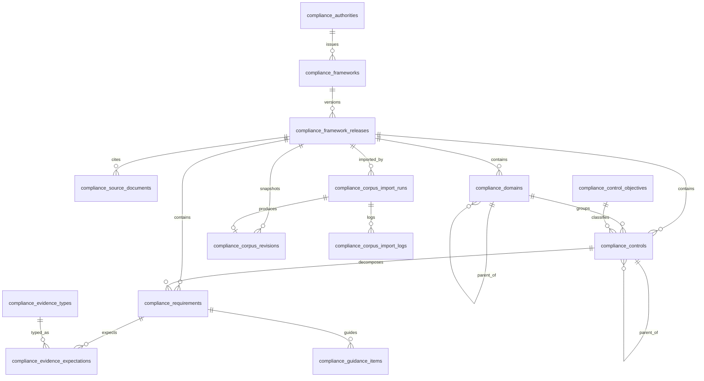

# QCIF Architecture Bible v1

**Document type:** Internal master document (single source of truth)
**Product:** Quenyx Compliance Intelligence Foundation (QCIF)
**Status:** v1 — current as of Sprint 7 (Knowledge Graph Layer)
**Audience:** Engineering, product, security, and compliance stakeholders (internal only)

> This is the canonical reference for QCIF's architecture, data model, pipelines, security
> posture, and roadmap. Per-sprint design docs live alongside this file
> (`docs/QCIF_SPRINT*.md`); this bible consolidates and supersedes them as the overview.

---

## Table of contents

1. [Executive Summary](#section-1--executive-summary)
2. [Architecture Timeline](#section-2--architecture-timeline)
3. [Data Model](#section-3--data-model)
4. [Corpus Philosophy](#section-4--corpus-philosophy)
5. [Import Pipeline](#section-5--import-pipeline)
6. [Security Model](#section-6--security-model)
7. [Compliance Intelligence Layer](#section-7--compliance-intelligence-layer)
8. [AI Roadmap](#section-8--ai-roadmap)
9. [Current Production Status](#section-9--current-production-status)
10. [Future Roadmap](#section-10--future-roadmap)

---

## SECTION 1 — Executive Summary

### What QCIF is

QCIF (Quenyx Compliance Intelligence Foundation) is the backend platform that turns
**official regulatory frameworks** (starting with **NCA ECC-2:2024**) into a trusted,
versioned, bilingual, machine-consumable **compliance corpus** — and exposes that corpus
through secure, read-only APIs designed for SaaS frontends and a future AI layer.

It is the foundation beneath **QynShield**, Quenyx's compliance/security module. QCIF owns
the *truth* (what the regulator actually says); QynShield and future AI features consume
that truth to help tenants assess, evidence, and report compliance.

### Why it exists

Compliance teams in Saudi Arabia and the wider region work against authoritative documents
(NCA ECC, SAMA, CST, PDPL, plus international standards like ISO 27001 and SOC 2). Those
documents are PDFs — bilingual, hierarchical, periodically revised, and legally sensitive.
Most "GRC" tooling re-types or paraphrases these controls, introducing drift, losing
provenance, and making bilingual + citation requirements impossible to honor.

QCIF exists to remove that drift permanently: a single, provenance-first corpus where every
domain, control, and requirement is traceable to an official source document, page, and
reference, in both English and Arabic, under an explicit revision.

### Problem statement

- Regulatory content is **authoritative and bilingual** but distributed as unstructured PDFs.
- Frameworks **change over time**; consumers must pin to a known revision and migrate safely.
- AI/GRC features need **grounded, citable** content — hallucinated controls are unacceptable.
- SaaS tenants need **isolated, entitled, audited** access to this content.

### Vision

A multi-framework compliance intelligence platform where:

1. Every framework is ingested from **official sources only**, with full provenance.
2. Content is **revisioned** and **immutable** per snapshot.
3. A layered intelligence stack (Corpus → AI Contract → Knowledge Graph → RAG → Copilot)
   lets AI features reason over compliance with **mandatory citations and guardrails**.
4. **Cross-framework mappings** let an organization answer "if I satisfy ECC 1-1-1, what
   does that mean for ISO 27001?" deterministically.

QCIF v1 delivers the corpus, the security model, and the first three intelligence layers —
**with no AI execution yet**, by design.

---

## SECTION 2 — Architecture Timeline

> Each sprint kept earlier architecture frozen and added a thin, well-scoped layer. Sprints
> marked *(no dedicated design doc)* are reconstructed from the codebase and corpus state;
> all others have a `docs/QCIF_SPRINT*.md` companion.

| Sprint | Theme | What was built |
| --- | --- | --- |
| **1** | Corpus Foundation | Core schema for the compliance corpus: authorities, frameworks, domains, control objectives, controls, requirements, guidance items, evidence types/expectations, import runs + logs. UUID-keyed entities, bilingual fields, provenance columns. Scope locked to NCA ECC-2:2024. |
| **1.1** *(no dedicated design doc)* | Schema hardening | Follow-up refinements to the Sprint 1 schema (constraints, indexes, normalized codes, casts/enums) ahead of population. |
| **2** | Population readiness | Official-source curation workflow + provenance fields + validator gates. Curation workspace under `backend/database/corpus/nca/ecc-2-2024/` (source-documents.json, curated-corpus.json). **No controls imported** — pipeline only. |
| **2A** | Versioning & hierarchy hardening | `compliance_corpus_revisions` (immutable snapshots, lineage, checksum, entity counts, status: draft/active/superseded/rolled_back), control self-hierarchy, deprecation, canonical/normalized codes. Architecture frozen for all future frameworks. |
| **3A** | Domain-based population workflow | Per-domain batch files + `manifest.json`, manifest loader, review lifecycle gates. Curators work one official ECC domain at a time; importer merges approved batches. |
| **3B** *(no dedicated design doc)* | Domain batch curation (cont.) | Continued curation of ECC domains into batch files under the manifest (governance, cyber defense, resilience, third-party/cloud, ICS), each citing official EN/AR sources. |
| **3C** *(no dedicated design doc)* | Domain batch completion + review | Completion of all 5 ECC domain batches and review/approval gating so the merged payload is import-ready. |
| **4** *(no dedicated design doc)* | Full ECC import + Revision v1 | Execution of the import pipeline against the approved batches: created import run, validated payload, produced **Corpus Revision v1** (5 domains, 108 controls, 108 requirements) and activated it. |
| **5** | Compliance Intelligence Layer v0 | Read-only global corpus HTTP API (`/api/compliance/corpus/*`, auth:sanctum): navigation (frameworks/domains/controls), summary, control profiles, SQL search. No AI/vectors. |
| **5.1** | Workspace-scoped corpus access | Workspace routes (`/api/workspaces/{project}/compliance/corpus/*`) gated by membership + **QynShield** entitlement, plus caching, rate limits, and audit logging. Corpus remains global reference data. |
| **6** | AI Consumption Contract Layer | Deterministic, AI-ready JSON payloads (control/domain/requirement profiles, corpus summary, search context) with **mandatory citations** and a fixed **guardrails** block. Workspace endpoints under `compliance/ai-context/*`. **No AI execution.** |
| **7** | Knowledge Graph Layer | Intra-framework graph navigation (Domain → Control → Requirement + control self-hierarchy): ancestors, descendants, siblings, framework/domain/control/requirement context. UUID-only nodes. Cross-framework provider interface seam (no implementation). Endpoints under `compliance/graph/*`. **No AI execution.** |

---

## SECTION 3 — Data Model

All compliance entities use a public **UUID** (via `HasComplianceUuid`) as their external
identifier; numeric primary keys are never exposed by the API layers. Bilingual fields use
`_en` / `_ar` suffixes. Provenance fields (`source_document_id`, `source_reference`,
`source_page`, `official_reference`) appear on the corpus entities.

### Entity relationship overview



### Authorities (`compliance_authorities`)

The regulator/standards body that issues frameworks. Key fields: `key`, `name_en/ar`,
`short_name`, `country_code`, `website_url`, `description_en/ar`, `status`
(`AuthorityStatus`), `sort_order`, `metadata`. Example: NCA (National Cybersecurity
Authority, KSA).

### Frameworks (`compliance_frameworks`)

A compliance framework family belonging to an authority. Fields: `key`, `code`, `title_en/ar`,
`authority_id`, plus descriptive/status fields. Example: **NCA ECC**.

### Releases (`compliance_framework_releases`)

A specific published version of a framework. Fields: `release_code`, `version_code`,
`title_en/ar`, `effective_date`, `published_at`, `deprecated_at`, `retired_at`, `status`
(`PublicationStatus`), `superseded_by_release_id`, `source_reference`, `metadata`. Example:
**ECC-2:2024**. All corpus entities are scoped by `framework_release_id`.

### Source documents (`compliance_source_documents`)

Official document **metadata only** — Quenyx does not store/upload corpus PDFs in v1.
Fields: `key`, `framework_release_id`, `title_en/ar`, `document_type`
(`SourceDocumentType`), `language` (`SourceDocumentLanguage`), `source_url`,
`official_file_name/mime/size`, `checksum_sha256`, `source_reference`, `publication_date`,
`effective_date`, `status`. Provenance points back to these by **key**.

### Domains (`compliance_domains`)

Top tier of the corpus tree (ECC: 5 domains). Fields: `code`, `display_code`,
`normalized_code`, `slug`, `title_en/ar`, `description_en/ar`, `parent_domain_id`
(self-hierarchy), `status`, `sort_order`, provenance, `superseded_by_domain_id`,
`migration_reference`.

### Controls (`compliance_controls`)

Middle tier; belong to a domain and may form a self-hierarchy via `parent_control_id` +
`level`. Fields: `code`, `display_code`, `normalized_code`, `slug`, `title_en/ar`,
`description_en/ar`, `control_type` (`ControlType`), `domain_id`, `parent_control_id`,
`level`, `control_objective_id`, `status`, `sort_order`, provenance, `tags`, `metadata`,
`superseded_by_control_id`.

### Requirements (`compliance_requirements`)

Leaf tier; belong to a control. Fields: `code`, `display_code`, `normalized_code`,
`title_en/ar`, `description_en/ar`, **`requirement_text_en/ar`** (the official requirement
body), `control_id`, `status`, `sort_order`, provenance, `superseded_by_requirement_id`.

### Revisions (`compliance_corpus_revisions`)

Immutable corpus snapshots per release. Fields: `revision_number` (monotonic per release),
`parent_revision_id` (lineage), `import_run_id`, `description`, `status`
(`CorpusRevisionStatus`: draft/active/superseded/rolled_back), `entity_counts`
(`{domains, controls, requirements, guidance_items}`), `checksum_sha256`, `created_by`,
`activated_at`, `superseded_at`. Exactly one **active** revision per release at a time.

### Import runs (`compliance_corpus_import_runs`)

Audit + control record for every ingestion attempt. Fields: `framework_id`,
`framework_release_id`, `source_document_id`, `format`, `source_path`, `content_hash`,
`import_type` (`ImportType`), `status` (`ImportRunStatus`), `dry_run`, `initiated_by`,
`started_at`/`completed_at`/`failed_at`, `summary`, `stats`, `rollback_data`,
`rollback_of_import_run_id`, `failure_message`. Has many `compliance_corpus_import_logs`
and produces at most one revision.

### Evidence expectations (`compliance_evidence_expectations`)

Per-requirement evidence the regulator expects (reference data; **no tenant evidence**).
Fields: `requirement_id`, `evidence_type_id`, `code`, `title_en/ar`, `description_en/ar`,
`is_required`, `recency_days`, `status`, provenance, `tags`. Typed via
`compliance_evidence_types`.

### Control objectives (`compliance_control_objectives`)

Cross-cutting objective classification for controls. Fields: `code`, `title_en/ar`,
`description_en/ar`, `category_en/ar`, `status`, `sort_order`, `source_reference`, `tags`.
Linked to controls directly (`control_objective_id`) and via
`compliance_control_objective_mappings`.

---

## SECTION 4 — Corpus Philosophy

These are non-negotiable invariants enforced across the schema, importer, validators, and
API layers.

- **Official sources only.** Every entity traces to an official source document (NCA portal
  + official EN/AR PDFs for ECC). Source URLs, checksums, and references are first-class.
- **No fake controls.** Nothing is invented to "fill gaps." If the regulator doesn't say
  it, it isn't in the corpus.
- **No generated controls.** No AI/LLM/OCR auto-extraction writes corpus content. Curation
  is human, from official text; AI never authors corpus truth.
- **Revision-based corpus.** Content is snapshotted into immutable revisions. Consumers pin
  to a release and read its **active** revision; new imports create new revisions rather
  than mutating existing rows.
- **Bilingual support.** English and Arabic are mandatory, not optional. The AI Contract
  Layer rejects payloads missing either language.
- **Provenance first.** `source_document_key`, `source_reference`, `source_page`, and
  `official_reference` accompany corpus entities so every downstream claim is citable.

---

## SECTION 5 — Import Pipeline

The pipeline (services under `app/Services/Compliance/Corpus/`, driven by
`php artisan` import commands) converts curated official content into an immutable revision.

```
Curated batches (official text)
   → Manifest                (ComplianceCorpusManifestLoader)
   → Payload assembly        (ComplianceCorpusPayloadLoader + batch metadata reader)
   → Validation              (ComplianceCorpusValidator, ComplianceCodeNormalizer)
   → Review + approval gates  (lifecycle flags in manifest / batches)
   → Import run              (ComplianceCorpusImporter; dry-run supported)
   → Revision creation       (ComplianceCorpusRevisionCreator → activate)
   → Rollback (if needed)    (rollback_data on import run; DryRunRollbackException)
```

### Manifest

`manifest.json` registers the framework release and its per-domain batch files. The
**manifest loader** resolves which batches exist and their review/approval state, supporting
domain-by-domain curation without a single monolithic file (legacy single-file
`curated-corpus.json` still supported).

### Batches

Each ECC domain is a batch (`<domain>/domain.json`) containing the official, bilingual,
provenance-bearing content for that domain's controls and requirements. Curators edit one
batch at a time; the **payload loader** merges approved batches into one import payload.

### Validation

`ComplianceCorpusValidator` enforces structural and provenance invariants (required
bilingual fields, valid codes, referential integrity, source references). The
`ComplianceCodeNormalizer` produces canonical `normalized_code` values so lookups and
hierarchy are deterministic. Validation failures block import (fail-closed).

### Review workflow

Batches carry review state; the manifest loader/metadata reader surface what is pending
manual review. Only reviewed content advances. (The corpus summary API exposes
`pending_manual_review` so operators can see outstanding items.)

### Approval workflow

Approved batches become eligible for merge + import. Approval is an explicit gate distinct
from review — content must be both reviewed and approved before an import run consumes it.

### Revision creation

A successful import run invokes `ComplianceCorpusRevisionCreator`, which writes a new
`compliance_corpus_revisions` row (next `revision_number`, parent lineage, `import_run_id`,
`entity_counts`, `checksum_sha256`) and activates it — superseding the prior active revision.
The active revision is what every read/AI/graph layer serves, and revision UUIDs are part of
cache keys so activation auto-invalidates stale cache entries.

### Rollback

Import runs support **dry-run** (validate + simulate, then roll back via
`DryRunRollbackException`) and record `rollback_data` / `rollback_of_import_run_id` so a
faulty import can be reversed and a revision marked `rolled_back`. This makes ingestion
safe to rehearse and recover.

---

## SECTION 6 — Security Model

| Layer | Mechanism |
| --- | --- |
| **Authentication** | Laravel **Sanctum** (`auth:sanctum`) on all corpus/AI/graph routes. |
| **Workspace isolation** | Workspace-scoped routes resolve `{project}` and enforce membership via `ProjectPolicy::view`. Corpus content is **global reference data** (not tenant rows), but *access* is workspace-gated. |
| **Entitlements** | Module access via the **QynShield** entitlement middleware (`project.qynshield`), combining membership + module entitlement. |
| **QynShield access** | All Sprint 5.1/6/7 workspace endpoints sit behind `project.qynshield`; only entitled workspaces reach the intelligence layers. |
| **Audit logging** | `ComplianceCorpusAccessAuditLogger` records access with distinct actions: `compliance_corpus_access`, `compliance_ai_context_access`, `compliance_graph_access` (user, project, endpoint, framework, release, context type). |
| **Abuse protection** | Per-feature rate limiters: `compliance-corpus-read/search`, `compliance-ai-context-read/search`, `compliance-graph-read` (configurable in `config/compliance.php`). |
| **Cache correctness** | Revision-keyed caching (`ComplianceCorpusCacheService`) so responses can't outlive a revision change. |
| **Data exposure** | UUID-only output; no numeric IDs; corpus content only — **no tenant data, no evidence** crosses these layers. |

Global (non-workspace) corpus routes remain for internal tooling and future AI consumers;
AI Contract and Graph layers are **workspace-scoped only** by design.

---

## SECTION 7 — Compliance Intelligence Layer

Three stacked, read-only layers over the immutable corpus — each deterministic, each with
**no AI execution**.

### Corpus APIs (Sprint 5 / 5.1)

Direct navigation and retrieval of corpus content.

- Global: `/api/compliance/corpus/*` (auth only) — frameworks, domains, controls, summary,
  control profiles, SQL `LIKE` search.
- Workspace: `/api/workspaces/{project}/compliance/corpus/*` — same, gated by QynShield +
  cached + rate-limited + audited.
- Services: `ComplianceCorpusQueryService`, `ComplianceCorpusNavigationService`,
  `ComplianceCorpusSearchService`.

### AI Contract APIs (Sprint 6)

Deterministic, **AI-ready** payloads that a future AI/RAG consumer can use as grounded
context — *defining the contract, not calling AI*.

- Context types: `control_profile`, `domain_profile`, `requirement_profile`,
  `corpus_summary`, `search_context`.
- Every payload carries **mandatory citations** (source document key, EN/AR titles, official
  reference, page, entity UUID/type) and a fixed **guardrails** block
  (`use_only_provided_context`, `cite_every_claim`, `bilingual_required`, etc.).
- Endpoints: `/api/workspaces/{project}/compliance/ai-context/*`.
- Services: `ComplianceAiContextService`, `ComplianceAiPromptContextBuilder`,
  `ComplianceAiCitationBuilder`, `ComplianceAiGuardrailService`.

### Knowledge Graph (Sprint 7)

Deterministic **structural** navigation of the corpus tree — the retrieval skeleton for AI
context expansion.

- Capabilities: `getFrameworkContext`, `getDomainContext`, `getControlContext`,
  `getRequirementContext`, `getAncestors`, `getDescendants`, `getSiblingControls`,
  `getSiblingRequirements`.
- UUID-only nodes (codes, EN/AR titles, provenance, active revision); intra-framework only.
- Cross-framework seam shipped as `CrossFrameworkMappingProviderInterface` (no
  implementation yet).
- Endpoints: `/api/workspaces/{project}/compliance/graph/*`.
- Services: `ComplianceKnowledgeGraphService`, `ComplianceRelationshipResolver`,
  `ComplianceCrossReferenceService`.

---

## SECTION 8 — AI Roadmap

### Current

- **AI Contract only.** QCIF prepares grounded, citable, bilingual context and a graph for
  expansion. **No OpenAI/LLM/RAG/vectors/embeddings/scoring** are executed anywhere in v1.
  Every AI-facing payload asserts `ai_executed = false`.

### Future (in dependency order)

1. **Knowledge Graph (delivered, Sprint 7)** — structural grounding for context expansion;
   the base for cross-framework reasoning.
2. **RAG** — vector index over corpus revisions + retrieval that *must* return citations and
   respect guardrails. Built on top of the AI Contract payloads (retrieval returns UUIDs →
   contract layer supplies grounded text + citations).
3. **Copilot** — conversational compliance assistant grounded strictly in retrieved corpus
   context, bilingual, citation-enforced, with the no-legal-advice disclaimer.
4. **Gap Assessment** — compare a tenant's posture against a framework revision; introduces
   tenant data + scoring (a new, separately-secured layer above QCIF).
5. **Evidence Intelligence** — map tenant evidence to `evidence_expectations`, check recency
   and sufficiency; introduces tenant evidence ingestion.
6. **Recommendations** — prioritized remediation guidance derived from gaps + graph
   relationships + cross-framework mappings.

**Guiding rule:** AI never authors corpus truth and never answers without citations. Each
future layer is additive and independently entitled/audited; the corpus stays immutable.

---

## SECTION 9 — Current Production Status

| Item | Value |
| --- | --- |
| **Framework** | NCA ECC (National Cybersecurity Authority — Essential Cybersecurity Controls) |
| **Release** | **ECC-2:2024** |
| **Active revision** | **v1** (status: active) |
| **Domains** | **5** |
| **Controls** | **108** |
| **Requirements** | **108** |
| **Sources** | Official NCA portal + official English PDF + official Arabic PDF (metadata + checksums tracked; PDFs not stored) |
| **Languages** | English + Arabic (mandatory) |
| **Live layers** | Corpus APIs (global + workspace), AI Consumption Contract Layer, Knowledge Graph Layer |
| **AI execution** | None (by design) |

---

## SECTION 10 — Future Roadmap

### Additional frameworks

The Sprint 2A architecture was frozen specifically so new frameworks need **no schema
redesign**. Planned ingestion (official sources only, same pipeline):

- **ISO/IEC 27001** — international ISMS standard.
- **SAMA** — Saudi Central Bank cybersecurity/CSF requirements.
- **CST** — Communications, Space & Technology Commission requirements.
- **PDPL** — Saudi Personal Data Protection Law.
- **SOC 2** — Trust Services Criteria.

### Cross-framework mappings

The roadmap's keystone: deterministic mappings between equivalent controls across frameworks
(e.g. ECC ⇄ ISO 27001 ⇄ NIST CSF). The seam already exists
(`CrossFrameworkMappingProviderInterface` + `ComplianceCrossReferenceService`), so a future
sprint binds a provider **without changing** graph services, controller, routes, or the
response contract. Mappings will be UUID-only, deterministic, and citable — enabling
"satisfy once, report many" comparative compliance and powering Gap Assessment and
Recommendations across frameworks.

### Sequencing

1. Onboard the next framework (ISO 27001) through the existing import pipeline → Revision v1.
2. Author cross-framework mappings (ECC ⇄ ISO 27001) and bind the provider.
3. Layer RAG + Copilot on the AI Contract + Graph foundation.
4. Introduce tenant-facing Gap Assessment, Evidence Intelligence, and Recommendations as
   separately-secured layers above the immutable corpus.

---

*End of QCIF Architecture Bible v1.*
