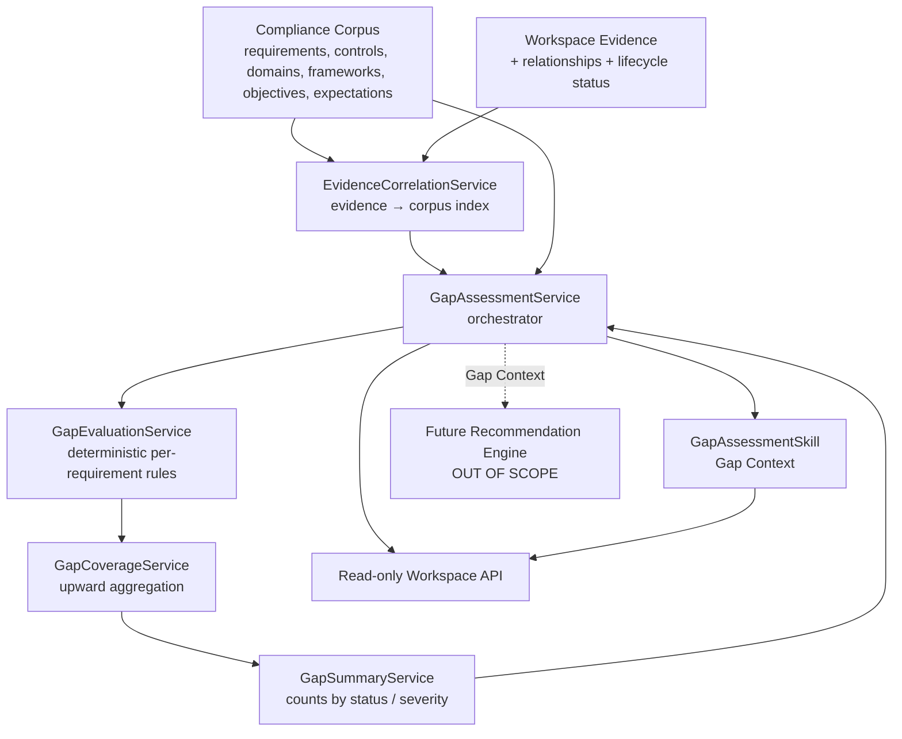
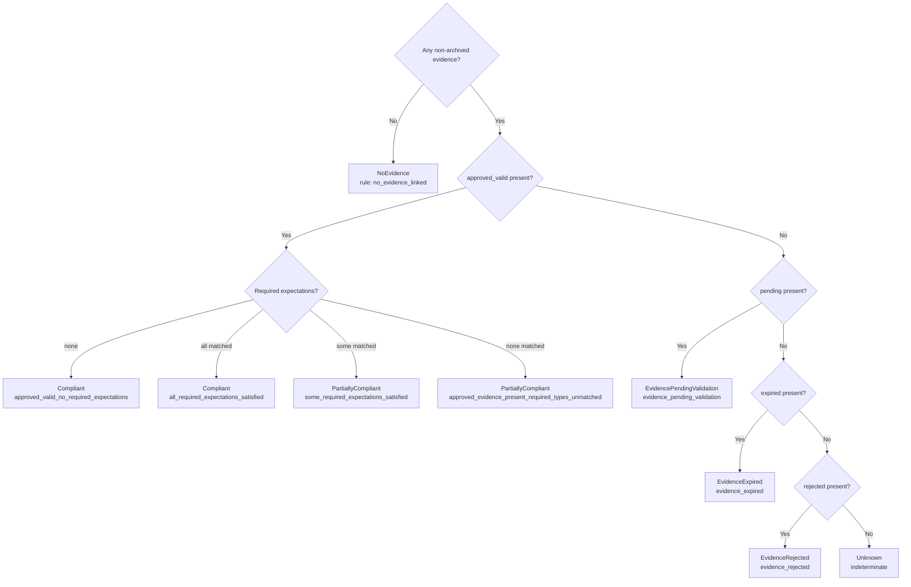
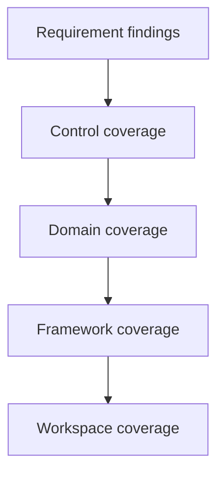

# QCIF Sprint 12 — Gap Assessment & Evidence Correlation Engine

> **Module:** QynShield · **Layer:** Compliance Intelligence
> **Status:** Complete · **AI execution:** None (deterministic only)

The first **Compliance Intelligence Engine**. It correlates tenant **Evidence** with the
compliance corpus (**Requirements → Controls → Domains → Frameworks → Control Objectives**) and
produces a **deterministic, explainable Gap Assessment**.

There is **no AI reasoning, no LLM decisions, no recommendations, and no AI-generated scoring**.
Every result is **reproducible** and references the requirement, the evidence, the evaluation
rule, the corpus revision, and the framework release.

---

## 1. Architecture

The engine is layered strictly on top of the existing foundations (Corpus, Revision, Provenance,
Knowledge Graph, Cross-Framework Mapping, Evidence Intelligence). It reuses their services and
adds **no** new corpus mutation, no uploads, and no AI.

---

## 2. Correlation Engine

`EvidenceCorrelationService` builds an in-memory index from **all** workspace evidence:

| Map | Built from |
| --- | --- |
| `requirement_evidence` | `evidence.requirement_id` + relationships `entity_type=requirement` |
| `control_evidence` | `evidence.control_id` + relationships `entity_type=control` |
| `domain_evidence` | relationships `entity_type=domain` |
| `framework_evidence` | relationships `entity_type=framework` |
| `objective_evidence` | derived: control → `control_objective_id` |

Supported correlation shapes:

- **One evidence → many requirements** — a single evidence row with many relationship rows.
- **Many evidence → one requirement** — many evidence rows pointing at the same requirement.
- **Cross-control aggregation** — evidence linked at the **control** level flows down to every
  requirement under that control.
- **Cross-domain aggregation** — handled at the coverage layer by rolling controls up to domains.

Applicability for a requirement = *direct requirement evidence* ∪ *its control's evidence*. Each
applicable item is tagged with its **origin** (`requirement` or `control`) for explainability.

Correlation is pure id-membership. Evidence is **never** correlated without an explicit corpus
link. Nothing is fabricated.

---

## 3. Evaluation Rules (deterministic)

Each applicable evidence is classified (by `GapAssessmentService::classify`) into exactly one
bucket:

| Classification | Condition |
| --- | --- |
| `approved_valid` | status = `approved` **and** not expired |
| `expired` | past `expires_at` **or** status = `expired` |
| `rejected` | status = `rejected` |
| `pending` | status ∈ {`registered`,`collected`,`validated`} and not expired |
| `archived` | status = `archived` (always ignored) |

`GapEvaluationService::evaluate` then applies a **fixed, ordered** ruleset:

Required-expectation matching is by `evidence_type_id`; an untyped required expectation is
satisfied by any approved, in-date evidence. There is **no probability, no percentage, no
confidence** anywhere — only counts and fixed branches.

**Severity** is a fixed map from status (`ComplianceGapSeverity::forStatus`): Compliant→none,
PartiallyCompliant→medium, PendingValidation→low, Expired/Rejected/NoEvidence/NonCompliant→high,
NotAssessed/Unknown→info. It is a label, never a risk score.

---

## 4. Coverage Aggregation

`GapCoverageService` rolls requirement findings upward by counting:

Aggregate status rule for any scope (given its requirement statuses):

| Condition | Aggregate status |
| --- | --- |
| `total == 0` | NotAssessed |
| `satisfied == total` | Compliant |
| `satisfied == 0` | NonCompliant |
| otherwise | PartiallyCompliant |

Each coverage node carries `totals.requirements`, `totals.satisfied`, and `totals.by_status`
(deterministic counts).

---

## 5. Gap Lifecycle & States

States are enums (`ComplianceGapStatus`):

`compliant`, `partially_compliant`, `non_compliant`, `no_evidence`, `evidence_expired`,
`evidence_rejected`, `evidence_pending_validation`, `not_assessed`, `unknown`.

Assessment history is **immutable** (append-only). `ComplianceGapAssessment`,
`ComplianceGapFinding`, and `ComplianceCoverageSnapshot` reject updates/deletes via the
`ImmutableModel` trait, guaranteeing a stored assessment always reflects its exact inputs.

> The read-only API computes assessments **live** (cached) and never persists. Persistence is
> performed only by `GapAssessmentService::createAssessment()` (for scheduled/triggered runs).

---

## 6. Explainability

Every finding exposes, with **no black-box logic**:

- `requirement` (uuid, code, titles, provenance)
- `control` and `domain` (related corpus context)
- `status`, `severity`, `evaluation_rule`, human `reason`
- `evidence_considered` (uuid, status, origin, reason)
- `evidence_ignored` (uuid, status, origin, reason — e.g. `expired`, `rejected`, `archived`,
  `superseded_by_approved`)
- `revision_uuid` and `framework_release` (uuid + version_code)

---

## 7. AI Skill

`GapAssessmentSkill` (key `gap_assessment`, context types `gap_context` / `gap_assessment`) reuses
`GapAssessmentService` and returns a **Gap Context** payload. It makes **no prompts, no AI
execution, and no provider calls**. Registered in `config/ai.php` under `skills.registered`.

---

## 8. API (read-only, workspace-scoped)

All routes require `auth:sanctum` (outer group) + `project.qynshield` (membership + entitlement),
are audit-logged (`compliance_gap_access`), cached (revision + evidence fingerprint), and rate
limited (`throttle:compliance-gap-read`). All responses are **UUID-only**.

| Method | Path | Purpose |
| --- | --- | --- |
| GET | `/api/workspaces/{project}/compliance/gap/summary` | Workspace summary (counts by status/severity) |
| GET | `/api/workspaces/{project}/compliance/gap/domains` | Domain + framework + workspace coverage |
| GET | `/api/workspaces/{project}/compliance/gap/controls/{controlCode}` | Control coverage + its requirement findings |
| GET | `/api/workspaces/{project}/compliance/gap/requirements/{requirementCode}` | Single requirement finding (full explainability) |
| POST | `/api/workspaces/{project}/compliance/gap/context` | Gap Context (via GapAssessmentSkill) |

Optional `framework` + `release` query params select the scope; otherwise the single active
release is resolved automatically. (`workspaces` and `projects` prefixes are both registered.)

---

## 9. Future Recommendation integration

The Gap Context is the deterministic input the future **Recommendation Engine** will consume.
That engine — along with the Compliance Copilot, RAG, OCR, document parsing, evidence uploads,
executive reports, risk prediction, and automatic remediation — remains **intentionally out of
scope** for this sprint. No part of this engine performs AI-generated compliance decisions.

---

## 10. Files

**New**

- `app/Enums/Compliance/Gap/ComplianceGapStatus.php`
- `app/Enums/Compliance/Gap/ComplianceGapSeverity.php`
- `app/Models/Compliance/Gap/Concerns/ImmutableModel.php`
- `app/Models/Compliance/Gap/ComplianceGapAssessment.php`
- `app/Models/Compliance/Gap/ComplianceGapFinding.php`
- `app/Models/Compliance/Gap/ComplianceCoverageSnapshot.php`
- `database/migrations/2026_06_25_030000_create_compliance_gap_tables.php`
- `app/Services/Compliance/Gap/EvidenceCorrelationService.php`
- `app/Services/Compliance/Gap/GapEvaluationService.php`
- `app/Services/Compliance/Gap/GapCoverageService.php`
- `app/Services/Compliance/Gap/GapSummaryService.php`
- `app/Services/Compliance/Gap/GapAssessmentService.php`
- `app/Services/Ai/Skills/GapAssessmentSkill.php`
- `app/Http/Controllers/Compliance/ComplianceGapController.php`
- `routes/compliance-gap.php`
- `tests/Unit/GapAssessmentEngineTest.php`
- `docs/QCIF_SPRINT12_GAP_ASSESSMENT.md`

**Modified**

- `app/Services/Compliance/Evidence/EvidenceNormalizationService.php` (+`correlationEvidence`)
- `app/Services/Compliance/ComplianceCorpusAccessAuditLogger.php` (+`logGap`)
- `config/ai.php` (registered `gap_assessment` skill)
- `config/compliance.php` (gap rate limit)
- `app/Providers/RouteServiceProvider.php` (`compliance-gap-read` limiter)
- `routes/api.php` (wire `compliance-gap.php`)
