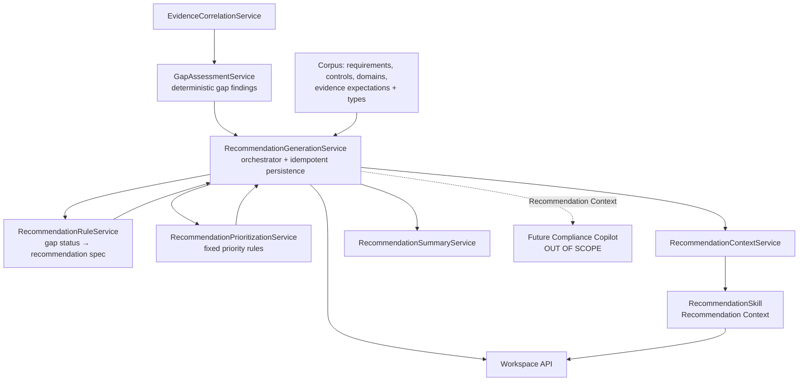
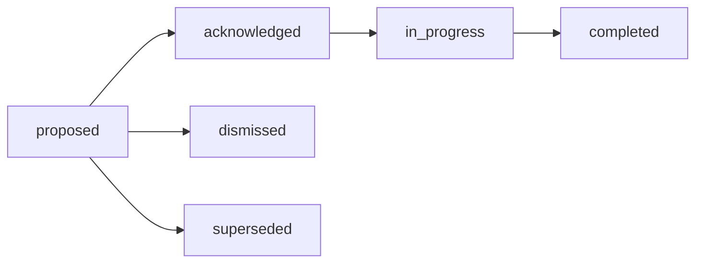

# QCIF Sprint 13 — Recommendation Engine

> **Module:** QynShield · **Layer:** Compliance Intelligence
> **Status:** Complete · **AI execution:** None (deterministic, rule-based)

Converts **gap findings** into **deterministic, explainable remediation recommendations**. It is
the layer above the Gap Assessment & Evidence Correlation Engine (Sprint 12) and feeds the future
Recommendation/Copilot experiences.

There are **no LLM-generated recommendations, no RAG, no Copilot, no risk prediction, and no
probabilistic scoring**. Every recommendation is reproducible and references the requirement, the
related control, the gap status, the evidence considered, the rule applied, the rationale, the
action items, the priority basis, the corpus revision, and the framework release.

---

## 1. Architecture

---

## 2. Deterministic Rule Model

`RecommendationRuleService::forFinding()` maps each gap status to exactly one recommendation
specification (or none). Fixed and ordered — same finding ⇒ same recommendation.

| Gap status | Recommendation type | Source rule | Action items |
| --- | --- | --- | --- |
| No Evidence | `collect_evidence` | `gap.no_evidence` | collect required evidence (named type if known), assign owner, set due date |
| Evidence Pending Validation | `validate_evidence` | `gap.evidence_pending_validation` | review evidence, approve/reject |
| Evidence Expired | `refresh_evidence` | `gap.evidence_expired` | collect current evidence, supersede expired |
| Evidence Rejected | `replace_evidence` | `gap.evidence_rejected` | provide replacement, remediation review |
| Partially Compliant | `complete_coverage` | `gap.partially_compliant` | identify missing expectations, collect remaining |
| Non-Compliant | `complete_coverage` | `gap.non_compliant` | review requirement, collect required evidence |
| Unknown | `manual_review` | `gap.unknown` | perform manual review |
| Compliant | *(none)* — `maintain_evidence` only if `include_compliant` requested | `gap.compliant_maintain` | monitor expiry |
| Not Assessed | *(none)* | — | — |

The engine **never invents control text**: titles reference only the requirement's own `code`
(corpus data); descriptions are generic remediation guidance, not legal advice. Bilingual
(`_en`/`_ar`) throughout.

---

## 3. Priority Model

Enum only: `critical`, `high`, `medium`, `low`, `informational` — **no numeric scores**.

`RecommendationPrioritizationService::priorityFor()` derives priority deterministically:

1. **Base** from the gap severity (itself a fixed map of gap status): critical→Critical,
   high→High, medium→Medium, low→Low, info/none→Informational.
2. **Escalate (take MAX)**:
   - No Evidence / Evidence Expired / Evidence Rejected / Non-Compliant → at least **High**.
   - Domain criticality `critical` → **Critical**; `high` → at least **High** (from
     `domain.metadata.criticality` if present).
3. **Conservative default** when inputs are unavailable (informational).

Each recommendation exposes a `priority_basis_en/ar` string explaining exactly which inputs drove
the priority.

---

## 4. Lifecycle

Status enum: `proposed`, `acknowledged`, `in_progress`, `completed`, `dismissed`, `superseded`.
Generated recommendations are always created as **`proposed`**. Records are **append-only**
(`ImmutableModel` trait rejects updates/deletes).

**Determinism & idempotency:** a recommendation's UUID is `uuid5(requirement + source_rule +
revision)`. Re-running `generate` for the same state produces identical UUIDs, so persistence is
idempotent (existing rows are left untouched; the response reports `created` vs `existing`). When
evidence changes and the gap status changes, the source rule changes ⇒ a new deterministic UUID ⇒
a new recommendation (the prior one can be `superseded` by a future workflow).

---

## 5. Explainability

Every recommendation exposes: related `requirement`, related `control` (and `domain`), `gap_status`
(+ labels), `evidence_considered` (uuid/status/origin/reason from the gap finding),
`source_rule` (rule applied), `rationale_en/ar`, `action_items`, `priority` + `priority_basis`,
`revision_uuid`, and `framework_release`. No black-box logic.

---

## 6. AI Skill

`RecommendationSkill` (key `recommendation`, context types `recommendation_context` /
`recommendations`) reuses `RecommendationContextService` and returns a **Recommendation Context**.
No prompts, no AI execution, no provider calls. Registered in `config/ai.php`.

---

## 7. API (workspace-scoped)

All routes: `auth:sanctum` (outer) + `project.qynshield` (membership + entitlement) + audit
(`compliance_recommendation_access`) + `throttle:compliance-recommendation-read`. GET responses are
cached (revision + evidence fingerprint). UUID-only.

| Method | Path | Purpose |
| --- | --- | --- |
| GET | `/api/workspaces/{project}/compliance/recommendations/summary` | Counts by priority / type / gap status |
| GET | `/api/workspaces/{project}/compliance/recommendations/controls/{controlCode}` | Recommendations for a control |
| GET | `/api/workspaces/{project}/compliance/recommendations/requirements/{requirementCode}` | Recommendations for a requirement |
| POST | `/api/workspaces/{project}/compliance/recommendations/context` | Recommendation Context (via RecommendationSkill) |
| POST | `/api/workspaces/{project}/compliance/recommendations/generate` | Generate + persist (deterministic, idempotent) |

Optional `framework` + `release` select scope; otherwise the single active release is resolved.
`include_compliant` (bool) optionally emits `maintain_evidence` recommendations for compliant
requirements. (`workspaces` and `projects` prefixes are both registered.)

---

## 8. Future AI / Copilot integration

The Recommendation Context is the deterministic, explainable input a future **Compliance Copilot**
(or recommendation-narration layer) will consume. The Copilot, RAG, OCR, evidence uploads,
automatic remediation, executive reports, risk prediction, and any LLM-generated recommendations
remain **intentionally out of scope**.

---

## 9. What this engine does NOT do

- No LLM/AI-generated recommendations, no RAG, no Copilot.
- No OCR, no document parsing, no evidence uploads.
- No automatic remediation, no risk prediction, no executive reports.
- No probabilistic scoring, no confidence percentages, no numeric priority scores.
- No invented control text, no fabricated evidence, no legal advice.

---

## 10. Files

**New**

- `app/Enums/Compliance/Recommendation/ComplianceRecommendationPriority.php`
- `app/Enums/Compliance/Recommendation/ComplianceRecommendationStatus.php`
- `app/Models/Compliance/Recommendation/ComplianceRecommendation.php`
- `app/Models/Compliance/Recommendation/ComplianceRecommendationAction.php`
- `database/migrations/2026_06_25_040000_create_compliance_recommendation_tables.php`
- `app/Services/Compliance/Recommendation/RecommendationRuleService.php`
- `app/Services/Compliance/Recommendation/RecommendationPrioritizationService.php`
- `app/Services/Compliance/Recommendation/RecommendationGenerationService.php`
- `app/Services/Compliance/Recommendation/RecommendationContextService.php`
- `app/Services/Compliance/Recommendation/RecommendationSummaryService.php`
- `app/Services/Ai/Skills/RecommendationSkill.php`
- `app/Http/Controllers/Compliance/ComplianceRecommendationController.php`
- `routes/compliance-recommendations.php`
- `tests/Unit/RecommendationEngineTest.php`
- `docs/QCIF_SPRINT13_RECOMMENDATION_ENGINE.md`

**Modified**

- `app/Services/Compliance/ComplianceCorpusAccessAuditLogger.php` (+`logRecommendation`)
- `config/ai.php` (registered `recommendation` skill)
- `config/compliance.php` (recommendations rate limit)
- `app/Providers/RouteServiceProvider.php` (`compliance-recommendation-read` limiter)
- `routes/api.php` (wire `compliance-recommendations.php`)
