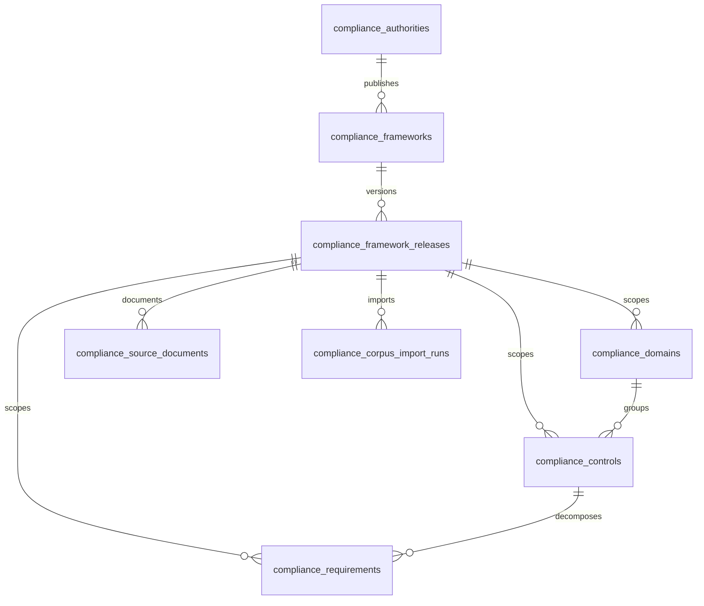

# QCIF Sprint 1 — NCA ECC-2:2024 Corpus Platform

**Project:** Quenyx Compliance Intelligence Foundation (QCIF v1)  
**Sprint:** 1 — Corpus Foundation  
**Scope:** NCA ECC-2:2024 only  
**Status:** Implementation-ready  

---

## 1. Entity Diagram

```mermaid
erDiagram
    compliance_frameworks ||--o{ compliance_domains : contains
    compliance_frameworks ||--o{ compliance_controls : contains
    compliance_domains ||--o{ compliance_domains : parent_of
    compliance_domains ||--o{ compliance_controls : groups
    compliance_control_objectives ||--o{ compliance_controls : classifies
    compliance_control_objectives ||--o{ compliance_control_objective_mappings : maps
    compliance_controls ||--o{ compliance_control_objective_mappings : mapped_from
    compliance_controls ||--o{ compliance_requirements : decomposes
    compliance_requirements ||--o{ compliance_guidance_items : guides
    compliance_requirements ||--o{ compliance_evidence_expectations : expects
    compliance_evidence_types ||--o{ compliance_evidence_expectations : typed_as
    compliance_frameworks ||--o{ compliance_corpus_import_runs : targeted_by
    compliance_corpus_import_runs ||--o{ compliance_corpus_import_logs : logs

    compliance_frameworks {
        uuid uuid PK
        string key
        string version_code
        string title_en
        string title_ar
        string status
        date effective_from
        json migration_reference
    }

    compliance_domains {
        uuid uuid PK
        fk framework_id
        fk parent_domain_id
        string code
        string title_en
        string title_ar
    }

    compliance_control_objectives {
        uuid uuid PK
        string code UK
        string title_en
        string title_ar
        string category_en
    }

    compliance_controls {
        uuid uuid PK
        fk framework_id
        fk domain_id
        fk control_objective_id
        string code
        string control_type
        fk superseded_by_control_id
    }

    compliance_requirements {
        uuid uuid PK
        fk control_id
        string code
        text requirement_text_en
        text requirement_text_ar
    }

    compliance_guidance_items {
        uuid uuid PK
        fk requirement_id
        text guidance_en
        text guidance_ar
        string guidance_type
    }

    compliance_evidence_types {
        uuid uuid PK
        string key UK
        string title_en
        string title_ar
    }

    compliance_evidence_expectations {
        uuid uuid PK
        fk requirement_id
        fk evidence_type_id
        bool is_required
        int recency_days
    }
```

### Hierarchy (normative tree)

```
Framework (NCA ECC-2:2024)
 └── Domain (supports nested subdomains via parent_domain_id)
      └── Control
           └── Requirement
                ├── Guidance (1..n)
                └── Evidence Expectation (1..n) → Evidence Type (catalog)
```

### Cross-cutting layer (future-proof)

```
Control Objective (canonical, framework-agnostic)
 └── Objective Mapping (optional, may be empty in Sprint 1)
      └── Control (NCA ECC)
```

---

## 2. Database Model

All tables are **global** (not tenant-scoped). Tenant isolation applies in Sprint 3+ when assessments and evidence artifacts are introduced.

| Table | Purpose |
|-------|---------|
| `compliance_frameworks` | Framework version catalog (one row per version, e.g. ECC 2:2024) |
| `compliance_domains` | Domain / subdomain hierarchy |
| `compliance_control_objectives` | Canonical objectives (IAM, logging, etc.) |
| `compliance_controls` | NCA ECC controls |
| `compliance_requirements` | Atomic testable requirements |
| `compliance_guidance_items` | Implementation / assessment guidance |
| `compliance_evidence_types` | Global evidence type catalog |
| `compliance_evidence_expectations` | Recommended evidence per requirement (metadata only) |
| `compliance_control_objective_mappings` | Objective ↔ control links (empty until curated) |
| `compliance_corpus_import_runs` | Import job audit |
| `compliance_corpus_import_logs` | Row-level import messages |

**Migration file:** `database/migrations/2026_06_18_100000_create_compliance_corpus_tables.php`

**Models:** `app/Models/Compliance/*`

**Enums:** `app/Enums/Compliance/*` (`PublicationStatus`, `ControlType`, `GuidanceType`, etc.)

---

## 3. Relationships

| Parent | Child | Cardinality | Delete rule |
|--------|-------|-------------|-------------|
| Framework | Domain | 1:N | CASCADE |
| Framework | Control | 1:N | CASCADE |
| Domain | Control | 1:N | CASCADE |
| Domain | Domain (child) | 1:N | SET NULL on parent |
| Control Objective | Control | 1:N | SET NULL |
| Control | Requirement | 1:N | CASCADE |
| Requirement | Guidance | 1:N | CASCADE |
| Requirement | Evidence Expectation | 1:N | CASCADE |
| Evidence Type | Evidence Expectation | 1:N | RESTRICT |
| Control Objective | Mapping | 1:N | CASCADE |
| Control | Mapping | 1:N | CASCADE |
| Framework | Import Run | 1:N | SET NULL |

**Unique keys (idempotent import):**

- `(framework.key, framework.version_code)`
- `(framework_id, domain.code)`
- `(framework_id, control.code)`
- `(control_id, requirement.code)`
- `(requirement_id, guidance.code)`
- `(requirement_id, evidence_expectation.code)`
- `control_objective.code` (global)
- `evidence_type.key` (global)

---

## 4. Migration Plan

### Step 1 — Apply schema

```bash
php artisan migrate
```

Creates all `compliance_*` tables. Reversible via migration `down()`.

### Step 2 — Seed shell catalog

```bash
php artisan db:seed --class=ComplianceCorpusSeeder
```

Seeds:

- **One** framework row: NCA ECC-2:2024 (`key=nca-ecc`, `version_code=2:2024`)
- **Eleven** evidence type rows (policy, procedure, log, …)

Does **not** seed controls.

### Step 3 — Curate corpus (Sprint 2)

Human experts prepare JSON from official NCA ECC-2:2024 publication.

### Step 4 — Import

```bash
php artisan compliance:import-corpus /path/to/nca-ecc-curated.json --framework=nca-ecc --release=2:2024 --dry-run
php artisan compliance:import-corpus /path/to/nca-ecc-curated.json --framework=nca-ecc --release=2:2024
```

### Rollback (import run)

```bash
php artisan compliance:import-corpus dummy.json --rollback=<import-run-uuid>
```

---

## 5. Seeder Strategy

| Seeder | Content | Idempotent |
|--------|---------|------------|
| `ComplianceCorpusSeeder` | Framework shell + evidence types | Yes (`updateOrCreate`) |
| Future `ComplianceCorpusPublishSeeder` | Flip draft → published after QA | Sprint 2 |
| **Not in seeder** | Domains, controls, requirements | Imported only |

**Registration:** `DatabaseSeeder` calls `ComplianceCorpusSeeder`.

---

## 6. Import Architecture

### Components

| Component | Path | Role |
|-----------|------|------|
| `ComplianceCorpusValidator` | `app/Services/Compliance/Corpus/` | Schema + duplicate + bilingual validation |
| `ComplianceCorpusImporter` | same | Idempotent upsert, transactions, rollback tracking |
| `ComplianceCorpusPayloadLoader` | same | JSON file + CSV flat-sheet loader |
| `ImportComplianceCorpusCommand` | `app/Console/Commands/` | CLI entry point |

### Supported formats

**JSON (primary)** — nested hierarchy matching the entity tree.  
Template: `database/corpus/examples/nca-ecc-2-2024.template.json`

**CSV (secondary)** — flat rows with `entity_type` column (`domain`, `control`, `requirement`, `control_objective`). Suitable for spreadsheet curation workflows.

### Import pipeline

```
Load file → Validate → Begin import_run → Transaction
  → Upsert framework metadata (optional)
  → Upsert control objectives
  → Upsert domains → controls → requirements → guidance → evidence expectations
  → Upsert objective mappings
  → Commit (or rollback on dry-run)
→ Write stats + rollback_data + import logs
```

### Safety properties

| Property | Implementation |
|----------|----------------|
| **Idempotent** | Upsert on natural keys `(framework_id, code)` etc. |
| **Validation first** | No DB writes until validator passes |
| **Dry run** | Transaction rolled back after full simulation |
| **Duplicate detection** | In-file duplicate codes rejected |
| **Import logs** | Per-run log rows with level, entity, message |
| **Rollback** | Deletes created rows; restores updated row snapshots |
| **No fake data** | Validator requires bilingual fields; seeder excludes controls |

### CLI

```bash
# Validate only
php artisan compliance:import-corpus corpus.json --dry-run

# Import
php artisan compliance:import-corpus corpus.json --format=json --framework=nca-ecc --release=2:2024

# Rollback
php artisan compliance:import-corpus corpus.json --rollback=<uuid>
```

---

## 7. Versioning Architecture

### Framework versions

Each publication is a **separate row**:

| key | version_code | Example |
|-----|--------------|---------|
| `nca-ecc` | `2:2024` | Current |
| `nca-ecc` | `3:2026` | Future |

Fields:

- `superseded_by_framework_id` — points to newer framework row
- `migration_reference` — JSON map `{ "2-1-1": "3-1-1" }` for control migrations
- `effective_from` / `effective_to` — validity window
- `status`: `draft` → `published` → `deprecated` → `retired`

### Entity-level supersession

Domains, controls, and requirements support:

- `superseded_by_*_id` self-FK
- `migration_reference` JSON
- `deprecated_at` timestamp

**Rule:** Never mutate published control text in place for a new framework edition — create new rows under the new framework version and link via migration references.

---

## 8. Localization Architecture

Framework content is stored **in the database**, not i18n translation files.

| Field pattern | Usage |
|---------------|--------|
| `title_en` / `title_ar` | Display titles |
| `description_en` / `description_ar` | Long descriptions |
| `requirement_text_en` / `requirement_text_ar` | Normative requirement text |
| `guidance_en` / `guidance_ar` | Guidance body |
| `authority_en` / `authority_ar` | Issuing authority |

**Import rule:** Both EN and AR are **required** for controls and requirements. Empty Arabic blocks import — prevents English-only fake corpus.

**Stable identifiers:** `code`, `slug`, and `uuid` are locale-neutral. UI may display Arabic with RTL; control codes remain canonical (e.g. `1-1-1`).

---

## 9. Risks

| Risk | Impact | Mitigation |
|------|--------|------------|
| **Unofficial control text** | Legal / audit invalidity | Human curation only; source_reference required; draft status until QA sign-off |
| **Incomplete Arabic corpus** | Regulatory UX failure | Bilingual required at import; block publish if AR missing |
| **Version drift** | Wrong framework cited | Unique `(key, version_code)`; explicit version in API (Sprint 2) |
| **Accidental overwrite** | Corpus corruption | Idempotent upsert + rollback_data + import logs |
| **Premature publish** | Clients see draft controls | Default status `draft`; publish workflow in Sprint 2 |
| **Evidence type mismatch** | Import failure | Evidence types seeded before corpus import |
| **Scope creep** | Delayed foundation | Sprint 1 excludes AI, scoring, tenant evidence, UI |

---

## 10. Future Extensibility

| Future sprint | Extension point |
|---------------|-----------------|
| **Sprint 2 — Full ECC import** | JSON import of all domains/controls; publish workflow |
| **Sprint 3 — ISO / SAMA / PDPL** | New `compliance_frameworks` rows; reuse same hierarchy tables |
| **Cross-framework mapping** | Populate `compliance_control_objective_mappings`; add `compliance_framework_mappings` table |
| **Tenant assessments** | New tenant-scoped tables referencing `control_id` + `requirement_id` by UUID |
| **Tenant evidence** | `compliance_evidence_artifacts` FK to `evidence_type_id` + storage URI |
| **Automated checks** | `compliance_automated_checks` FK to `requirement_id` |
| **RAG / vectors** | Export published corpus chunks from DB — corpus remains source of truth |
| **API layer** | Read-only endpoints: framework tree, control detail, evidence expectations |
| **QynSight integration** | Map `check_key` → `requirement_id` (Sprint 4+) |

### Multi-tenant readiness

Corpus tables are global read-only for tenants. Sprint 3+ will add `workspace_id` only to assessment and evidence artifact tables — not to normative corpus.

---

## Appendix A — Metadata Fields (all corpus entities)

| Field | Description |
|-------|-------------|
| `uuid` | Stable external identifier |
| `code` | Framework-native or catalog code |
| `slug` | URL-safe identifier |
| `version_code` | On framework only |
| `effective_from` / `effective_to` | Validity (framework) |
| `status` | draft / published / deprecated / retired |
| `published_at` / `deprecated_at` | Lifecycle timestamps |
| `sort_order` | Display ordering |
| `source_reference` | Official document pointer (page, section, URL) |
| `authority` | Issuing body |
| `tags` | JSON array for filtering |
| `migration_reference` | JSON for version migrations |

---

## Appendix B — Evidence Types (seeded)

| key | EN | AR |
|-----|----|----|
| policy | Policy | سياسة |
| procedure | Procedure | إجراء |
| log | Log | سجل |
| configuration | Configuration | إعداد |
| screenshot | Screenshot | لقطة شاشة |
| report | Report | تقرير |
| approval | Approval | موافقة |
| ticket | Ticket | تذكرة |
| inventory | Inventory | جرد |
| audit_record | Audit Record | سجل تدقيق |
| training_record | Training Record | سجل تدريب |

Evidence expectations reference these by `evidence_type_key` at import time.

---

## Appendix C — What Sprint 1 Deliberately Excludes

- AI / RAG / vector stores  
- Personas  
- Scoring / compliance percentages  
- Gap assessment  
- Dashboards  
- Tenant evidence artifacts  
- Assessment engine  
- HTTP API / UI  

---

## Appendix D — Sprint 2 Checklist

1. Obtain official NCA ECC-2:2024 bilingual source  
2. Curate JSON corpus (remove EXAMPLE template rows)  
3. `--dry-run` import and fix validation errors  
4. Production import + QA review  
5. Set control statuses to `published` after sign-off  
6. Add read API for framework tree (optional)  
7. Begin ISO 27001 framework family + release (schema supports it)

---

## Sprint 1.1 — Architecture Hardening

**Migration:** `2026_06_18_110000_harden_compliance_corpus_schema.php`

### Updated ERD



### Authority model

`compliance_authorities` — regulatory issuers (NCA, SAMA, ISO, etc.)

| Field | Purpose |
|-------|---------|
| `key` | Stable slug (`nca`) |
| `name_en` / `name_ar` | Display names |
| `country_code` | Jurisdiction (SA) |
| `status` | active / inactive |

### Framework family vs release

| Layer | Table | Example |
|-------|-------|---------|
| **Family** | `compliance_frameworks` | `nca-ecc` — NCA Essential Cybersecurity Controls |
| **Release** | `compliance_framework_releases` | `2:2024` / `ECC-2:2024` |

Version-specific fields moved to **releases**: `effective_date`, `published_at`, `deprecated_at`, `retired_at`, `source_reference`, `migration_reference`, `superseded_by_release_id`.

Families link to authorities via `authority_id`.

### Source document model

`compliance_source_documents` — metadata-only tracking of official PDFs/regulations per release. No file storage or upload in QCIF v1.

External official file fields: `official_file_name`, `official_file_mime`, `official_file_size` (not Quenyx uploads).

### Corpus scoping

Domains, controls, and requirements now carry **`framework_release_id`** (source of truth). `framework_id` retained as denormalized family reference.

Unique constraints:

- `unique(framework_release_id, code)` — domains, controls  
- `unique(framework_release_id, control_id, code)` — requirements  

### Import command changes

```bash
php artisan compliance:import-corpus corpus.json \
  --dry-run \
  --framework=nca-ecc \
  --release=2:2024
```

`--release-version` remains as deprecated alias for `--release` (Artisan reserves `--version`).

Import runs now store: `framework_release_id`, `source_document_id`, `import_type`, `summary`, `failed_at`, `rollback_of_import_run_id`.

Status `running` renamed to **`importing`**.

### Migration notes

1. Run Sprint 1 migration first (if not already applied)  
2. Run `2026_06_18_110000_harden_compliance_corpus_schema.php`  
3. Existing Sprint 1 NCA ECC-2:2024 row auto-migrates to family + release  
4. Re-run seeder to align authority/family/release metadata  

### Seeder notes (Sprint 1.1)

`ComplianceCorpusSeeder` seeds:

1. NCA authority  
2. `nca-ecc` framework family  
3. `2:2024` release  
4. 11 evidence types  

### Backward compatibility

| Item | Notes |
|------|-------|
| `framework_id` on corpus entities | Kept; populated from release |
| `dry_run` column on import runs | Kept; mirrored by `import_type` |
| `stats` column | Kept; duplicated into `summary` |
| `--release-version` CLI flag | Deprecated alias for `--release` (do not use `--version`) |
| JSON payload `framework.version_code` | Still required; matched against release |
| Sprint 1 unique `(key, version_code)` on frameworks | Removed; replaced by `unique(key)` + release table |

---

## Sprint 1.1 — Architecture Audit Fixes

**Migration:** `2026_06_18_120000_qcif_sprint_1_1_audit_hardening.php`

Post-hardening audit fixes applied before Sprint 2 / full corpus QA.

### 1. Source document metadata (external only)

`compliance_source_documents` remains **metadata-only**. No upload, storage, or file serving in QCIF v1.

Official external document fields (renamed for clarity):

| Column | Purpose |
|--------|---------|
| `source_url` | Official public URL (NCA portal, regulator site) |
| `official_file_name` | Filename as published by the authority (not a Quenyx upload) |
| `official_file_mime` | MIME type of the official document |
| `official_file_size` | Byte size of the official document |
| `checksum_sha256` | Integrity hash of the official file (optional) |

### 2. Rollback auditability

Rollback creates a **new** `compliance_corpus_import_runs` row:

| Field | Value |
|-------|--------|
| `import_type` | `rollback` |
| `rollback_of_import_run_id` | Original import run ID |
| `framework_release_id` | Copied from original |
| `status` | `pending` → `importing` → `completed` or `failed` |

The original run is marked `rolled_back` only (its `import_type` stays `import`). Rollback logs attach to the new rollback run.

```bash
php artisan compliance:import-corpus corpus.json --rollback=<original-import-run-uuid>
```

### 3. `framework_release_id` enforcement

After backfill, NOT NULL is enforced on:

- `compliance_domains.framework_release_id`
- `compliance_controls.framework_release_id`
- `compliance_requirements.framework_release_id`

Migration fails if any null rows remain (prevents silent partial scoping).

### 4. Unique constraints (release-aware)

**Source of truth:**

| Table | Unique constraint |
|-------|-------------------|
| `compliance_domains` | `(framework_release_id, code)` |
| `compliance_controls` | `(framework_release_id, code)` |
| `compliance_requirements` | `(framework_release_id, control_id, code)` |

**Removed legacy constraints** (block multiple releases per family):

- `(framework_id, code)` on domains and controls
- `(control_id, code)` on requirements (superseded by release-scoped unique)

### 5. Import run status

Canonical active status: **`importing`** (replaces legacy `running`).

Migration `120000` normalizes any remaining `running` rows to `importing`.

### Audit QA commands

```bash
cd backend
php artisan migrate --force
php artisan db:seed --class=ComplianceCorpusSeeder --force

php artisan compliance:import-corpus database/corpus/examples/nca-ecc-2-2024.template.json \
  --dry-run --framework=nca-ecc --release=2:2024

# Verify NOT NULL (should return 0 for each)
php artisan tinker --execute="
foreach (['compliance_domains','compliance_controls','compliance_requirements'] as \$t) {
  echo \$t.': '.DB::table(\$t)->whereNull('framework_release_id')->count().PHP_EOL;
}
"

# Verify source document columns
php artisan tinker --execute="
echo Schema::hasColumn('compliance_source_documents','official_file_name') ? 'official_* ok' : 'missing';
"
```
