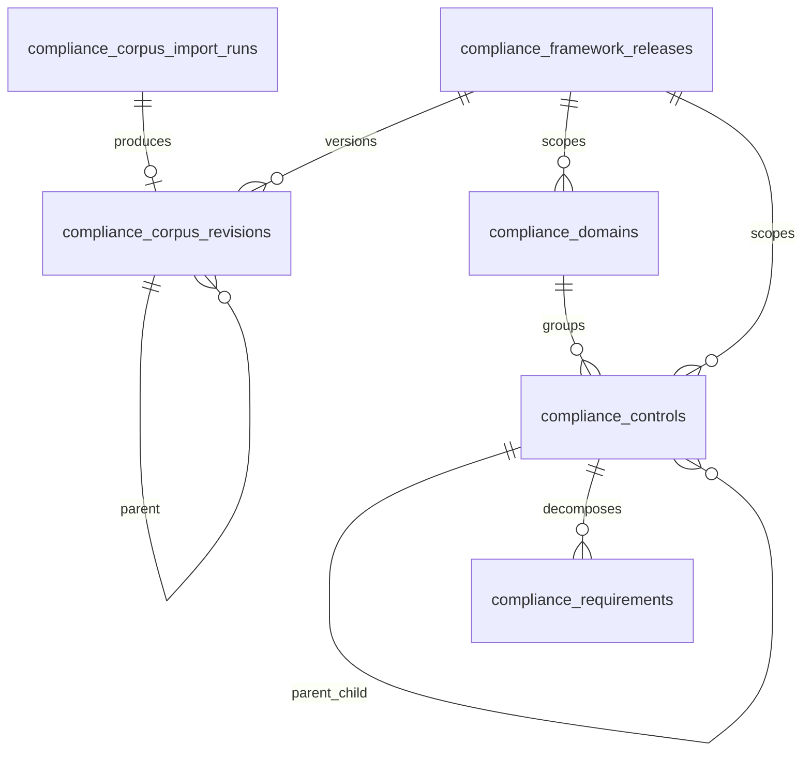

# QCIF Sprint 2A — Corpus Versioning & Hierarchy Hardening

**Phase:** Architecture freeze before NCA ECC-2:2024 population  
**Scope:** Revisions, control hierarchy, deprecation, canonical codes  
**Out of scope:** Control import, AI/RAG, assessments, UI

---

## Objective

Freeze the corpus architecture so future frameworks (NCA ECC, CST, SAMA CSF, ISO 27001, SOC 2, PDPL) work without schema redesign.

---

## 1. Revision model

`compliance_corpus_revisions` tracks immutable corpus snapshots per framework release.

| Field | Purpose |
|-------|---------|
| `framework_release_id` | Scoped release (e.g. ECC 2:2024) |
| `revision_number` | Monotonic integer per release |
| `parent_revision_id` | Previous revision lineage |
| `import_run_id` | Import that produced this revision |
| `status` | draft / active / superseded / rolled_back |
| `entity_counts` | `{ domains, controls, requirements, guidance_items }` |
| `checksum_sha256` | Payload hash from import |

**Unique:** `(framework_release_id, revision_number)`

**Lifecycle (preparation):** On successful non-dry-run import, revision is created with `status=active`, `revision_number=max+1`, linked to import run. No activation/supersession automation yet.

**Future use:**

| Revision | Purpose |
|----------|---------|
| v1 | Initial import |
| v2 | Corrections |
| v3 | Translation updates |
| v4 | Cross-framework mappings |

---

## 2. Control hierarchy model

Supports future **Domain → Control → Sub-control → Requirement** without schema changes.

| Column | Table | Purpose |
|--------|-------|---------|
| `parent_control_id` | `compliance_controls` | Self-FK to parent control |
| `level` | `compliance_controls` | Depth (default `1`) |
| `sort_order` | `compliance_controls` | Display order (existing) |

**JSON import (future):** optional `parent_control_code`, `level` on control objects.

**Relationships:**

- `Control` → `parentControl()` / `childControls()`

No recursive import behavior in Sprint 2A — schema and validation only.

---

## 3. Deprecation model

Deprecation support on domains, controls, and requirements (from Sprint 1, retained):

| Column | Domains | Controls | Requirements |
|--------|---------|----------|--------------|
| `deprecated_at` | ✓ | ✓ | ✓ |
| `superseded_by_*_id` | `superseded_by_domain_id` | `superseded_by_control_id` | `superseded_by_requirement_id` |

**Validator:** deprecated entities must reference a superseded successor (`superseded_by_*_code` in JSON or DB FK).

Historical corpus is never deleted — ECC 3:2026 migrations link via supersession.

---

## 4. Canonical code model

| Column | Purpose |
|--------|---------|
| `code` | Original stable identifier (never mutated) |
| `display_code` | Official format (e.g. `ECC-1-1`) |
| `normalized_code` | Cross-framework key (e.g. `ecc_1_1`) |

**Normalization rules** (`ComplianceCodeNormalizer`):

- Lowercase
- Replace `.`, `*`, `/`, `-`, spaces → `_`
- Collapse repeated underscores

**Unique per release:** `(framework_release_id, normalized_code)` on domains, controls, requirements (separate indexes per table).

---

## 5. UUID audit

All external-facing corpus entities expose `uuid`:

| Table | UUID |
|-------|------|
| `compliance_authorities` | ✓ |
| `compliance_framework_releases` | ✓ |
| `compliance_source_documents` | ✓ |
| `compliance_domains` | ✓ |
| `compliance_controls` | ✓ |
| `compliance_requirements` | ✓ |
| `compliance_guidance_items` | ✓ |
| `compliance_corpus_revisions` | ✓ |
| `compliance_corpus_import_runs` | ✓ |

Numeric IDs remain internal only.

---

## Updated ERD



---

## Migration notes

**Migration:** `2026_06_18_140000_qcif_sprint_2a_versioning_hierarchy.php`

Run after Sprint 1.1 and Sprint 2 preparation migrations:

```bash
php artisan migrate --force
```

Idempotent column/index checks. Backfills `display_code` / `normalized_code` from existing `code` when present.

---

## Validator hardening (Sprint 2A)

| Rule | Description |
|------|-------------|
| Duplicate `normalized_code` | Per entity type within import payload |
| Self-reference | `parent_control_code` ≠ own `code` |
| Circular chains | Lightweight parent chain walk (max depth 32) |
| `sort_order` | Must be ≥ 0 |
| `level` | Must be ≥ 1 |
| Deprecated entities | Require superseded_by reference |

---

## Future ECC 3:2026 support

| Mechanism | How |
|-----------|-----|
| New release row | `compliance_framework_releases` for `3:2026` |
| Corpus revision | New revision under 3:2026 release |
| Deprecation | Mark 2:2024 controls deprecated + `superseded_by_*_id` |
| Cross-release mapping | `normalized_code` + `compliance_control_objective_mappings` |
| Sub-controls | `parent_control_id` + `level` |

No schema redesign required.

---

## QA commands

```bash
cd backend
php artisan migrate --force
php artisan db:seed --class=ComplianceCorpusSeeder --force

php artisan compliance:seed-source-documents \
  database/corpus/nca/ecc-2-2024/source-documents.json \
  --framework=nca-ecc --release=2:2024

php artisan compliance:import-corpus \
  database/corpus/nca/ecc-2-2024/curated-corpus.json \
  --dry-run --framework=nca-ecc --release=2:2024

# After approved non-dry-run import (future):
# php artisan tinker --execute="
# echo \App\Models\Compliance\ComplianceCorpusRevision::count();
# "
```

**Syntax check changed PHP files:**

```bash
php -l app/Models/Compliance/ComplianceCorpusRevision.php
php -l app/Services/Compliance/Corpus/ComplianceCodeNormalizer.php
php -l app/Services/Compliance/Corpus/ComplianceCorpusRevisionCreator.php
php -l database/migrations/2026_06_18_140000_qcif_sprint_2a_versioning_hierarchy.php
```

---

## Related docs

- [QCIF Sprint 1 Corpus](./QCIF_SPRINT1_CORPUS.md)
- [QCIF Sprint 2 Preparation](./QCIF_SPRINT2_NCA_ECC_CORPUS.md)

---

**Verdict:** QCIF Sprint 2A complete. Architecture frozen. Ready for Sprint 3 — NCA ECC-2:2024 Corpus Population.
