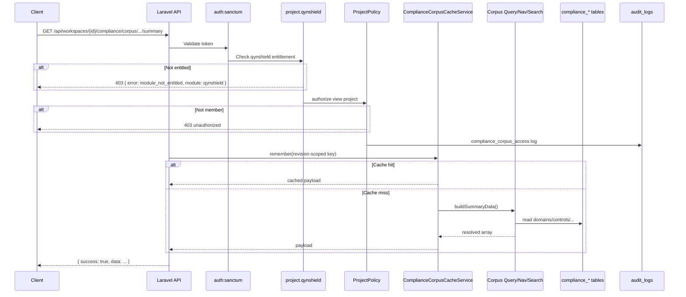

# QCIF Sprint 5.1 — Workspace-Scoped Corpus Access

**Phase:** SaaS-ready corpus consumption  
**Scope:** Workspace routes, QynShield entitlement, caching, rate limits, audit logging  
**Out of scope:** AI, RAG, vectors, scoring, assessments, UI

---

## Purpose

Sprint 5 exposed read-only corpus APIs globally (auth only). Sprint 5.1 adds **workspace-scoped routes** for SaaS frontend consumption, gated by:

1. Sanctum authentication
2. Workspace membership (`ProjectPolicy@view`)
3. **QynShield** module entitlement

Corpus data remains **global reference data** — workspace routes do not tenant-isolate corpus rows.

Global routes remain for internal tooling and future AI consumers.

---

## Architecture



---

## Global vs workspace APIs

| Aspect | Global `/api/compliance/corpus/*` | Workspace `/api/{projects|workspaces}/{project}/compliance/corpus/*` |
|--------|-----------------------------------|-----------------------------------------------------------------------|
| Auth | `auth:sanctum` | `auth:sanctum` |
| Membership | No | `ProjectPolicy@view` |
| Entitlement | No | `project.qynshield` (QynShield) |
| Audit log | No | Yes (`compliance_corpus_access`) |
| Intended consumer | Internal jobs, future AI | QynShield SaaS UI |
| Response format | Identical | Identical |

---

## Endpoints (workspace)

Base: `/api/projects/{project}/compliance/corpus` or `/api/workspaces/{project}/compliance/corpus`

| Method | Path |
|--------|------|
| GET | `/frameworks` |
| GET | `/frameworks/{frameworkKey}/releases` |
| GET | `/frameworks/{frameworkKey}/releases/{releaseCode}/summary` |
| GET | `/frameworks/{frameworkKey}/releases/{releaseCode}/domains` |
| GET | `/frameworks/{frameworkKey}/releases/{releaseCode}/domains/{domainCode}` |
| GET | `/frameworks/{frameworkKey}/releases/{releaseCode}/controls/{controlCode}` |
| GET | `/frameworks/{frameworkKey}/releases/{releaseCode}/search?q=` |

Example (NCA ECC-2:2024):

```
GET /api/workspaces/{uuid}/compliance/corpus/frameworks/nca-ecc/releases/2%3A2024/summary
```

---

## RBAC and entitlement flow

1. **Sanctum** — valid API token required (401 if missing).
2. **`project.qynshield` middleware** — `EntitlementService::hasEffectiveModuleAccess($project, 'qynshield')`.
   - Failure → **403**:
     ```json
     { "error": "module_not_entitled", "module": "qynshield" }
     ```
3. **`ProjectPolicy@view`** — owner or any workspace member (owner/admin/member/viewer).
   - Failure → **403** (Laravel authorization).

---

## Caching

Service: `ComplianceCorpusCacheService`

| Setting | Env | Default |
|---------|-----|---------|
| Enabled | `COMPLIANCE_CORPUS_CACHE_ENABLED` | `true` |
| TTL (seconds) | `COMPLIANCE_CORPUS_CACHE_TTL` | `3600` |

**Cached endpoints:** summary, domains, domain detail, control profile, search (+ static frameworks/releases lists).

**Cache keys** include active revision UUID:

```
qcif:corpus:{framework}:{release}:{revision_uuid}:summary
qcif:corpus:{framework}:{release}:{revision_uuid}:search:{hash}
```

**Invalidation:** When a new corpus revision is activated, `ComplianceCorpusRevisionCreator` clears the revision pointer cache. New revision UUID produces new keys — stale entries expire via TTL.

Uses Laravel default cache driver (file/redis/database — no Redis required).

---

## Rate limiting

| Limiter | Routes | Default | Env |
|---------|--------|---------|-----|
| `compliance-corpus-read` | All read endpoints except search | 120/min per user | `COMPLIANCE_CORPUS_READ_RATE_LIMIT` |
| `compliance-corpus-search` | `/search` | 30/min per user | `COMPLIANCE_CORPUS_SEARCH_RATE_LIMIT` |

Applied to **both** global and workspace routes. Falls back to client IP when unauthenticated (should not occur on these routes).

Global `api` throttle (120/min) still applies as outer middleware group limit.

---

## Audit logging

Service: `ComplianceCorpusAccessAuditLogger`

**Workspace routes only.** Writes to `audit_logs`:

| Field | Value |
|-------|-------|
| `action` | `compliance_corpus_access` |
| `user_id` | Authenticated user |
| `project_id` | Workspace |
| `metadata.framework` | e.g. `nca-ecc` |
| `metadata.release` | e.g. `2:2024` |
| `metadata.endpoint` | e.g. `summary`, `control`, `search` |
| `timestamp` | Request time |

No request body, query strings, or corpus text logged.

---

## Future AI consumers

Recommended pattern:

- **Batch / agent jobs:** use global `/api/compliance/corpus/*` with service account token.
- **User-facing QynShield:** use workspace routes (entitlement + audit).
- Always reference `active_revision.uuid` and entity UUIDs in downstream artifacts — never mutate revision v1 in place.

---

## QA commands

```bash
cd backend

# List all compliance corpus routes
php artisan route:list --path=compliance

# Syntax check
php -l app/Http/Middleware/EnsureQynShieldEntitlement.php
php -l app/Services/Compliance/ComplianceCorpusCacheService.php
php -l app/Http/Controllers/Compliance/ComplianceCorpusController.php

# Entitlement test (requires seeded project + token)
# Non-entitled project → 403 { "error": "module_not_entitled", "module": "qynshield" }
# Entitled member → 200 { "success": true, "data": ... }

# Cache verification
php artisan tinker --execute="
Cache::flush();
app(\App\Services\Compliance\ComplianceCorpusCacheService::class)->remember('nca-ecc','2:2024','summary', fn() => ['test'=>1]);
echo Cache::has('qcif:corpus:nca-ecc:2:2024:'.app(\App\Services\Compliance\ComplianceCorpusQueryService::class)->getActiveRevision(app(\App\Services\Compliance\ComplianceCorpusQueryService::class)->resolveRelease('nca-ecc','2:2024'))->uuid.':summary') ? 'hit' : 'miss';
"
```

### curl examples

```bash
TOKEN="..."
PROJECT="workspace-uuid"

# Entitled workspace summary
curl -s -H "Authorization: Bearer $TOKEN" \
  "https://host/api/workspaces/$PROJECT/compliance/corpus/frameworks/nca-ecc/releases/2%3A2024/summary"

# Global (internal) — same payload, no audit
curl -s -H "Authorization: Bearer $TOKEN" \
  "https://host/api/compliance/corpus/frameworks/nca-ecc/releases/2%3A2024/summary"
```

---

## Files

| File | Role |
|------|------|
| `routes/compliance-corpus.php` | Global + workspace route registration |
| `app/Http/Middleware/EnsureQynShieldEntitlement.php` | QynShield 403 format |
| `app/Services/Compliance/ComplianceCorpusCacheService.php` | Revision-scoped cache |
| `app/Services/Compliance/ComplianceCorpusAccessAuditLogger.php` | Workspace access audit |
| `config/compliance.php` | Cache TTL + rate limits |
| `app/Http/Controllers/Compliance/ComplianceCorpusController.php` | Cached handlers + workspace wrappers |

---

## Related docs

- [QCIF Sprint 5 — Compliance Intelligence Layer](./QCIF_SPRINT5_COMPLIANCE_INTELLIGENCE_LAYER.md)

---

**Verdict:** Sprint 5.1 complete. QCIF corpus services are SaaS-ready and safe for future AI consumers. No AI introduced.
