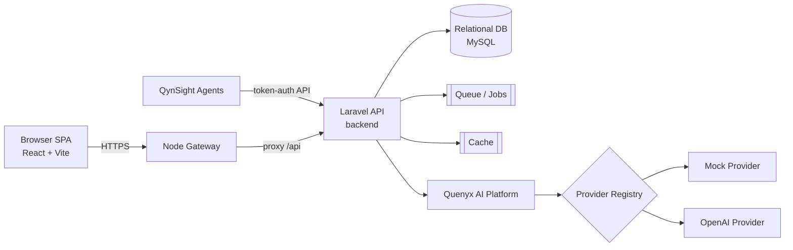
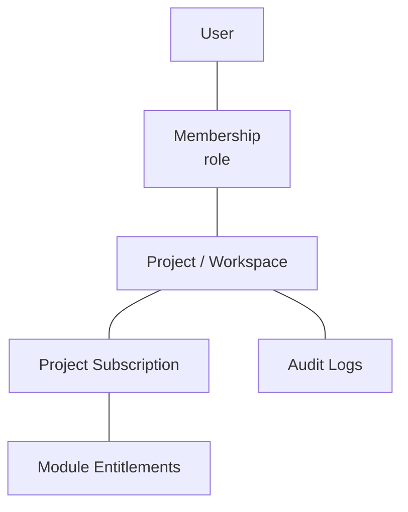
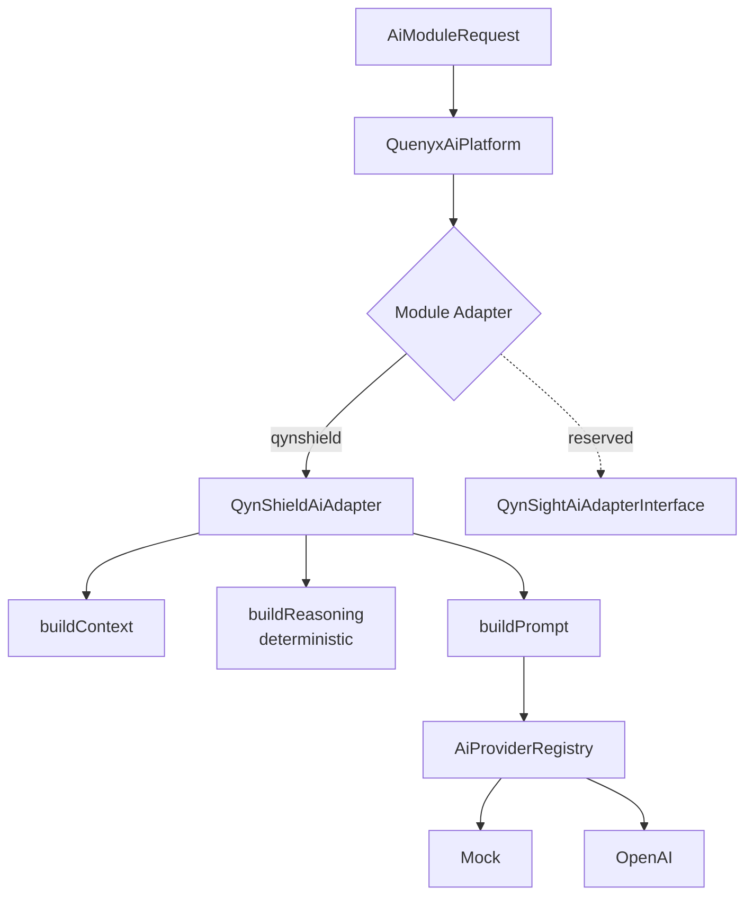
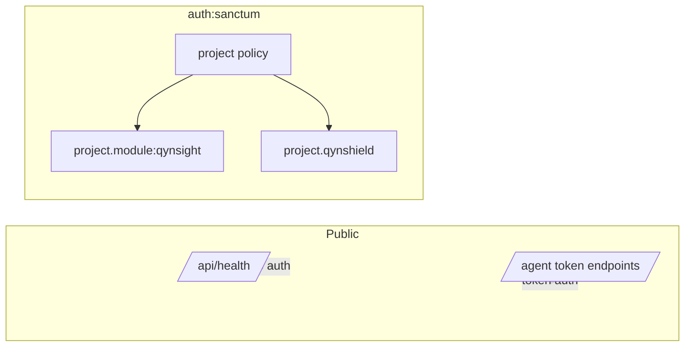

# 05 — Quenyx Platform Architecture Bible

**Audience:** Architects, senior engineers, auditors.
**Status basis:** Phase I, Sprint 19. Diagrams reflect the **current** code.

---

## 1. Platform architecture (high level)

Quenyx vOPS HUB is a **monorepo** with three runtimes — a Laravel API backend, a React SPA frontend,
and a Node gateway — over a relational database, queue, and cache.

## 2. Monorepo structure

| Path | Runtime | Responsibility |
|---|---|---|
| `backend/` | Laravel (PHP 8.3) | API, services, QCIF engines, AI platform, persistence |
| `frontend/` | React + Vite + TS | SPA UI, module registry, workspace UX |
| `gateway/` | Node | Edge/proxy layer in front of the API |
| `agent/` | — | QynSight host agent artifacts |
| `docs/` | — | Documentation (this pack lives in `docs/quenyx-v1/`) |
| `scripts/` | — | Operational scripts |

## 3. Backend / frontend / gateway

- **Backend** — `routes/api.php` is the single entry, requiring per‑domain route files
  (`compliance-corpus.php`, `compliance-graph.php`, `ai-orchestration.php`, `compliance-copilot.php`,
  `compliance-rag.php`, `compliance-executive.php`, `quenyx-ai.php`, …). Controllers are thin;
  business logic lives in `app/Services/**`.
- **Frontend** — React SPA; module/route registry in `src/constants/platformRegistry.ts`; layout
  and sidebar in `src/layouts/AppLayout.tsx`.
- **Gateway** — Node service in front of the API (edge concerns / proxy). Build & run on the server
  (see Doc 10); not buildable in the audit sandbox (no Node).

## 4. Workspace / project model

The tenant boundary is the **project** (a.k.a. **workspace** — the two are API aliases pointing to
the same controllers, see `routes/api.php`). Users belong to projects via **memberships** with
roles; modules are entitled per project via **subscriptions** and **module overrides**.

## 5. RBAC and entitlements

- **Authentication:** Laravel **Sanctum**; all tenant routes live under `auth:sanctum`.
- **Authorization:** project membership enforced via `ProjectPolicy` (controllers call
  `authorize('view', $project)`).
- **Module entitlements:** middleware gates feature areas:
  - `project.module:qynsight` → QynSight `observe/*` routes.
  - `project.qynshield` → all QynShield/QCIF routes (corpus workspace, copilot, evidence, gap,
    recommendations, retrieval, RAG, executive).
- **Overrides:** `ProjectModuleOverrideController` allows per‑project module access overrides
  (audited).

## 6. Module registry

The **frontend** registry (`platformRegistry.ts`) defines **all 12 modules** (qynsight, qyncore,
qynrun, qynbalance, qynsupport, qynintegrations, qynasset, qynknow, qynnotify, qynreact, qynshield,
qynva). Sidebar **visibility** is a **separate** concern controlled by
`HIDE_NON_QYNSIGHT_MODULES = true` + `ACTIVE_MODULE_KEYS = ['qynsight']` via
`isModuleTemporarilyVisible()`. The **backend** additionally tracks module AI‑readiness in
`config/quenyx_ai.php` + `QuenyxModuleCatalog` (production / reserved / planned), independent of UI.

## 7. QynSight architecture

QynSight ("observe") provides monitoring. Agents authenticate with enrollment tokens / secrets and
push **metrics**, **inventory**, and **heartbeats**; the backend exposes summaries, performance,
capacity, alerts (rules/history/channels/profiles), service checks, instances, infra topology, and
port scans. Tables are the `observe_*` and `agents*` groups (see Doc 09).

## 8. QynShield architecture

QynShield is the QCIF compliance engine (see Doc 06 for depth). Layered services:
corpus → graph → mapping → evidence → gap → recommendation → copilot → executive, all read‑only and
**deterministic**, all UUID/provenance‑based, all behind `project.qynshield`.

## 9. Quenyx AI Platform architecture

A shared runtime (see Doc 07) that any module consumes through an **adapter**.

## 10. API layer

REST/JSON under `/api`. Conventions: sanctum auth, policy + entitlement middleware, per‑group
throttles (`compliance-copilot`, `compliance-rag`, `compliance-executive`, `ai` chat/skills). Path
params use **codes** (framework/release/control/requirement) and **UUIDs** for entities. See Doc 08.

## 11. Service layer

All business logic is in `app/Services/**` (e.g. `Services/Compliance/**`, `Services/Ai/**`,
`Services/QuenyxAI/**`). Controllers validate + delegate; services are deterministic and testable;
AI access is funneled through the provider registry only.

## 12. Database layer

MySQL via Eloquent; **65 migrations** across groups: identity/projects/plans/subscriptions/modules,
integrations, audit, QynSight (`observe_*`, agents), jobs, and QCIF (corpus, evidence, gap,
recommendation, RAG vectors, AI orchestration, mapping). UUIDs for domain entities; immutability and
provenance enforced in corpus tables (see Doc 09).

## 13. Cache

Laravel cache is used for resolver/scope caching and rate limiting (`RateLimiter` named limiters in
`RouteServiceProvider`). Cache driver is environment‑configured.

## 14. Queues

`jobs` and `failed_jobs` tables exist. RAG indexing/deletion are **queue jobs**
(`IndexCorpusRevisionForRag`, `IndexRetrievalChunk`, `DeleteVectorIndexForRevision`). A queue worker
is required when RAG indexing is enabled (see Doc 10).

## 15. Audit logging

`audit_logs` table + `AuditLogController`. Sensitive actions (module overrides, executive reads,
copilot, etc.) write structured audit entries. Prompt content is **not** logged unless prompt
logging is explicitly enabled.

## 16. Security boundaries

Boundaries: public health; token‑authed agent ingestion; everything else sanctum + project policy +
module/QynShield entitlement. AI is an additional opt‑in layer behind feature flags.

## 17. Deployment architecture

Ubuntu host(s): Nginx terminates TLS and serves the React build + reverse‑proxies `/api` (optionally
via the Node gateway) to PHP‑FPM (Laravel). MySQL, a cache store, a queue worker, and the Laravel
scheduler run alongside. See Doc 10.

## 18. Current limitations

- QynShield has rich backend/API but an **earlier‑stage UI** (executive/demo layer is the current
  surface).
- Real‑model AI and RAG are **feature‑flagged**, not GA.
- Audit‑sandbox could not run DB/tests/frontend/gateway builds (tooling gaps) — these run on
  CI/CloudQuenyx (see QA report).
- One low‑risk **shadowed duplicate route** (`/ai/chat`) noted in the QA report.
