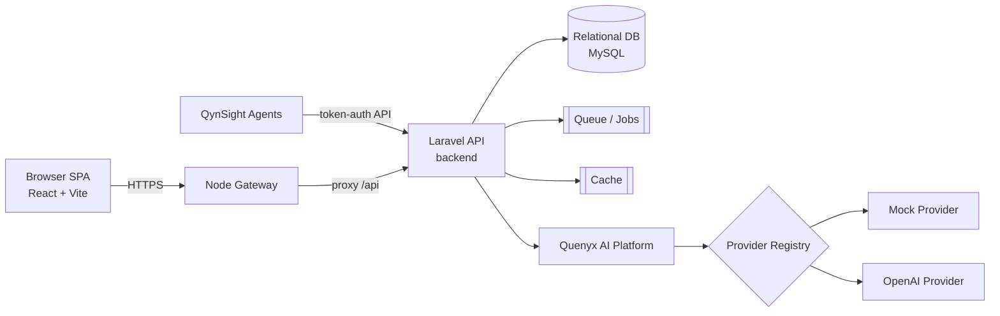
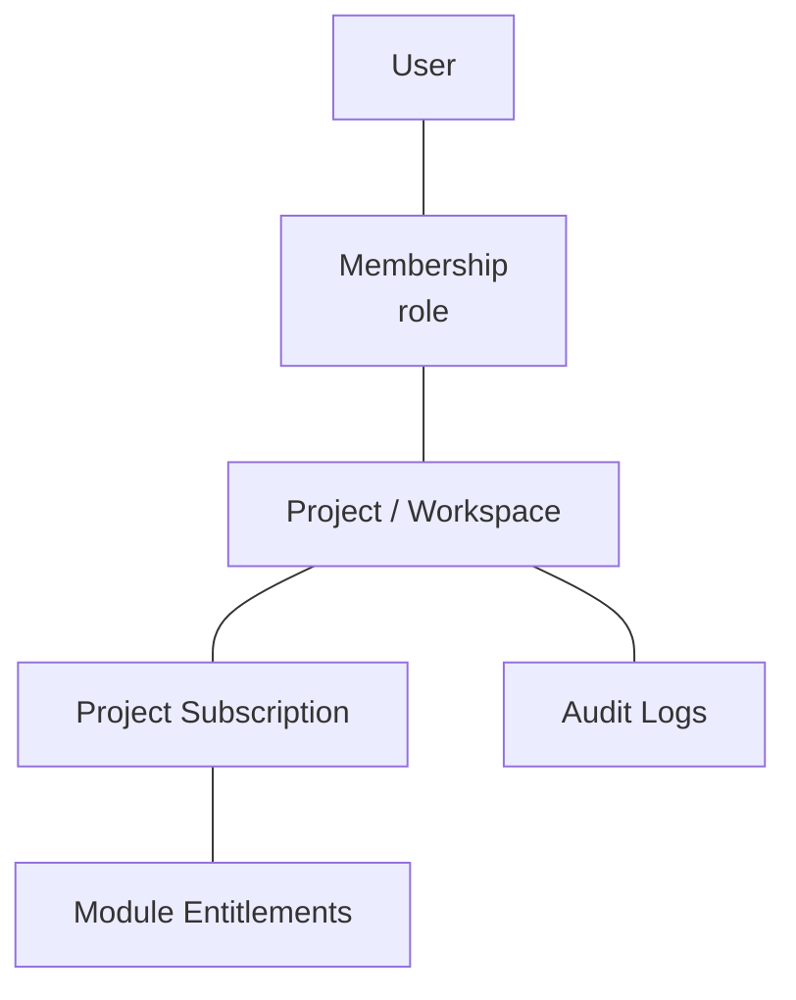
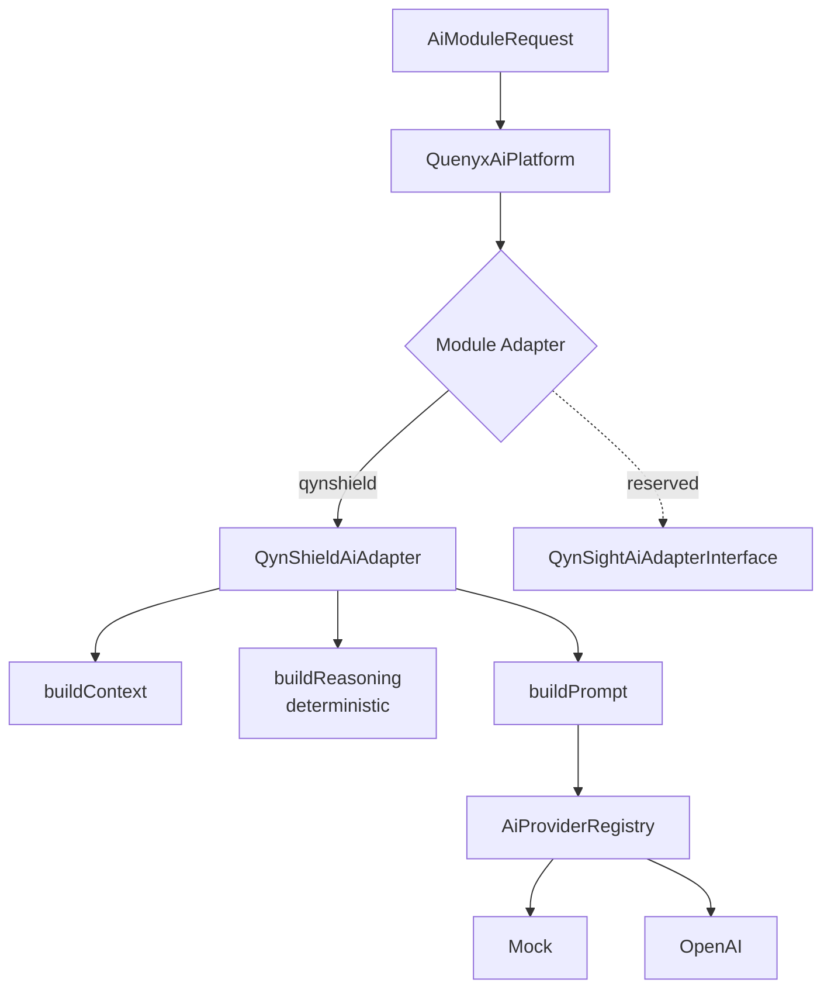
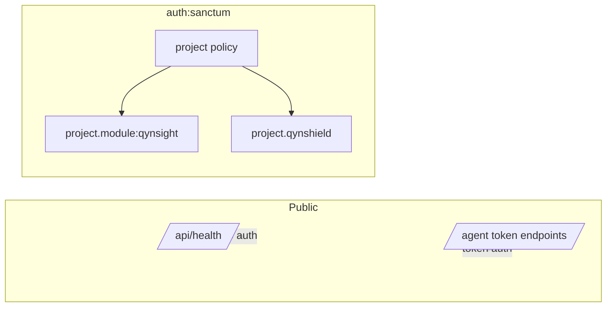

# 05 — Quenyx Platform Architecture Bible

> **Quenyx vOPS HUB — Document Metadata**
>
> | Field | Value |
> |---|---|
> | Document Version | 2.0 |
> | Software Version | v1.0.0 RC1 |
> | Applies To | Quenyx vOPS HUB v1.0.0 RC1 |
> | Classification | Confidential — Architecture |
> | Owner | Platform Architecture |
> | Status | Released |
> | Last Updated | 2026-06-29 |
> | Document Type | Architecture reference |
>
> **Revision History**
>
> | Version | Date | Notes |
> |---|---|---|
> | 1.0 | 2026 | Initial architecture bible (through Sprint 19). |
> | 2.0 | 2026-06-29 | RC1 alignment: native QynSight engines, QynCore internal communication model, Integrations = external only, shared platform AI. |

**Audience:** Architects, senior engineers, auditors.
**Status basis:** v1.0.0 RC1. Diagrams reflect the **current** production code.

---

## 1. Platform architecture (high level)

Quenyx vOPS HUB is a **monorepo** with three runtimes — a Laravel API backend, a React SPA frontend,
and a Node gateway — over a relational database, queue, and cache.

## 2. Monorepo structure

| Path | Runtime | Responsibility |
|---|---|---|
| `backend/` | Laravel (PHP 8.3) | API, services, QCIF engines, AI platform, persistence |
| `frontend/` | React + Vite + TS | SPA UI, module registry, workspace UX |
| `gateway/` | Node | Edge/proxy layer in front of the API |
| `agent/` | — | QynSight host agent artifacts |
| `docs/` | — | Documentation (this pack lives in `docs/quenyx-v1/`) |
| `scripts/` | — | Operational scripts |

## 3. Backend / frontend / gateway

- **Backend** — `routes/api.php` is the single entry, requiring per‑domain route files
  (`compliance-corpus.php`, `compliance-graph.php`, `ai-orchestration.php`, `compliance-copilot.php`,
  `compliance-rag.php`, `compliance-executive.php`, `quenyx-ai.php`, …). Controllers are thin;
  business logic lives in `app/Services/**`.
- **Frontend** — React SPA; module/route registry in `src/constants/platformRegistry.ts`; layout
  and sidebar in `src/layouts/AppLayout.tsx`.
- **Gateway** — Node service in front of the API (edge concerns / proxy). Build & run on the server
  (see Doc 10); not buildable in the audit sandbox (no Node).

## 4. Workspace / project model

The tenant boundary is the **project** (a.k.a. **workspace** — the two are API aliases pointing to
the same controllers, see `routes/api.php`). Users belong to projects via **memberships** with
roles; modules are entitled per project via **subscriptions** and **module overrides**.

## 5. RBAC and entitlements

- **Authentication:** Laravel **Sanctum**; all tenant routes live under `auth:sanctum`.
- **Authorization:** project membership enforced via `ProjectPolicy` (controllers call
  `authorize('view', $project)`).
- **Module entitlements:** middleware gates feature areas:
  - `project.module:qynsight` → QynSight `observe/*` routes.
  - `project.qynshield` → all QynShield/QCIF routes (corpus workspace, copilot, evidence, gap,
    recommendations, retrieval, RAG, executive).
- **Overrides:** `ProjectModuleOverrideController` allows per‑project module access overrides
  (audited).

## 6. Module registry

The **frontend** registry (`platformRegistry.ts`) defines all module entries. The **business
modules** are: QynSight, QynShield, QynAsset, QynRun, QynKnow, QynNotify, QynReact, QynVA,
QynSupport, and QynBalance. Sidebar **visibility** is a **separate** concern controlled by
`HIDE_NON_QYNSIGHT_MODULES = true` + `ACTIVE_MODULE_KEYS = ['qynsight']` via
`isModuleTemporarilyVisible()`. Hidden modules are **registered platform modules disabled in the
navigation by a sidebar flag** — not removed; flipping the flag restores them. The **backend**
additionally tracks module AI‑readiness in `config/quenyx_ai.php` + `QuenyxModuleCatalog`
(production / reserved / planned), independent of UI.

> **`QynCore` and `Integrations` are not business modules.** `QynCore` is the **platform core** —
> the internal services layer through which modules communicate (see §6.1). `Integrations` is a
> **platform page** for **external** systems only (see §6.2). As of **RC1.1**, the frontend business
> catalog (`platformRegistry.ts`) and the AI module universe (`config/quenyx_ai.php`) no longer list
> `qynintegrations` as a business module, and `qyncore` is documented there as the platform core. The
> `qyncore` / `qynintegrations` keys are **retained only as entitlement keys** (plans, subscriptions,
> and the gateway gate for `/integrations*`) for backward compatibility — never presented as business
> modules.

### 6.1 Internal communication — QynCore platform services

Modules **never** talk to each other over HTTP, webhooks, or the Integrations page. Internal
communication is **platform‑native**, brokered by **QynCore**:

| QynCore service | Responsibility | Backed today by |
|---|---|---|
| Platform Event Bus | Asynchronous in‑platform events between modules | Laravel events + `jobs` queue |
| Domain Events | Module‑level domain notifications | Eloquent/domain events |
| Shared Services | Cross‑module services (identity, billing/subscription, common AI) | `app/Services/**` |
| Module Registry | Known modules + entitlement state | `platformRegistry.ts`, subscriptions/overrides |
| Service Registry | Discoverable platform services/capabilities | `QuenyxAiPlatform` capability catalog |
| AI Context Broker | Workspace‑scoped context handed to the AI platform | `AiContext` / `QuenyxAiPlatform` |
| Permission Broker | Centralized authorization decisions | `ProjectPolicy` + entitlement middleware |
| Audit Pipeline | Structured, immutable audit of sensitive actions | `audit_logs` + audit loggers |
| Notification Broker | In‑platform notification fan‑out | notification/event surfaces |
| Workspace Context | Tenant (project/workspace) resolution + isolation | project↔workspace resolver |

Modules communicate **automatically through the platform**; there is no module‑to‑module HTTP,
webhook, or integration dependency.

### 6.2 Integrations (platform page, external only)

The **Integrations** page connects Quenyx to **external** systems — e.g. Microsoft, Azure, AWS,
OCI, Google Cloud, GitHub, GitLab, ServiceNow, Jira, Fortinet, Cisco, VMware, Slack, Teams, Splunk,
Elastic, Wazuh, REST APIs, Webhooks, LDAP, Active Directory, Entra ID, SMTP. It is **not** a module
and carries **no** internal module‑to‑module traffic. (Legacy Nagios, where still in use, is one such
optional external integration / migration source — never a platform dependency.)

## 7. QynSight architecture (native monitoring)

QynSight ("observe") provides **native** monitoring — there is **no external monitoring daemon and
no Nagios dependency**. It is composed of native engines:

- **Discovery Engine** — target/host discovery and port scans.
- **Monitoring Engine** — runs service checks (HTTP, TCP, Ping, and custom plugin scripts) in‑platform
  via the scheduled `observe:run-checks` command (`engine_key = 'native'`).
- **Metrics Engine** — agent metrics ingestion (CPU, memory, disk, network, inventory, heartbeats).
- **Service Checks** — per‑service check/retry intervals; standard 0/1/2/3 = OK/Warning/Critical/Unknown.
- **Alert Engine** — rule evaluation and event generation via scheduled `observe:evaluate-alerts`,
  with channels and monitoring profiles.
- **Capacity Planning** — trend/forecast over collected metrics.
- **Analytics** — performance analytics and reporting.
- **Infrastructure Map** — live topology of hosts/services.

Agents authenticate with enrollment tokens / secrets and push **metrics**, **inventory**, and
**heartbeats**; the backend exposes summaries, performance, capacity, alerts
(rules/history/channels/profiles), service checks, instances, infra topology, and port scans. Tables
are the `observe_*` and `agents*` groups (see Doc 09). Nagios may appear **only** as a legacy
migration source or an optional external integration (via Integrations) — never as a platform
dependency.

## 8. QynShield architecture

QynShield is the QCIF compliance engine (see Doc 06 for depth). Layered services:
corpus → graph → mapping → evidence → gap → recommendation → copilot → executive, all read‑only and
**deterministic**, all UUID/provenance‑based, all behind `project.qynshield`.

## 9. Quenyx AI Platform architecture

A shared runtime (see Doc 07) that any module consumes through an **adapter**.

## 10. API layer

REST/JSON under `/api`. Conventions: sanctum auth, policy + entitlement middleware, per‑group
throttles (`compliance-copilot`, `compliance-rag`, `compliance-executive`, `ai` chat/skills). Path
params use **codes** (framework/release/control/requirement) and **UUIDs** for entities. See Doc 08.

## 11. Service layer

All business logic is in `app/Services/**` (e.g. `Services/Compliance/**`, `Services/Ai/**`,
`Services/QuenyxAI/**`). Controllers validate + delegate; services are deterministic and testable;
AI access is funneled through the provider registry only.

## 12. Database layer

MySQL via Eloquent; **65 migrations** across groups: identity/projects/plans/subscriptions/modules,
integrations, audit, QynSight (`observe_*`, agents), jobs, and QCIF (corpus, evidence, gap,
recommendation, RAG vectors, AI orchestration, mapping). UUIDs for domain entities; immutability and
provenance enforced in corpus tables (see Doc 09).

## 13. Cache

Laravel cache is used for resolver/scope caching and rate limiting (`RateLimiter` named limiters in
`RouteServiceProvider`). Cache driver is environment‑configured.

## 14. Queues

`jobs` and `failed_jobs` tables exist. RAG indexing/deletion are **queue jobs**
(`IndexCorpusRevisionForRag`, `IndexRetrievalChunk`, `DeleteVectorIndexForRevision`). A queue worker
is required when RAG indexing is enabled (see Doc 10).

## 15. Audit logging

`audit_logs` table + `AuditLogController`. Sensitive actions (module overrides, executive reads,
copilot, etc.) write structured audit entries. Prompt content is **not** logged unless prompt
logging is explicitly enabled.

## 16. Security boundaries

Boundaries: public health; token‑authed agent ingestion; everything else sanctum + project policy +
module/QynShield entitlement. AI is an additional opt‑in layer behind feature flags.

## 17. Deployment architecture

Ubuntu host(s): Nginx terminates TLS and serves the React build + reverse‑proxies `/api` (optionally
via the Node gateway) to PHP‑FPM (Laravel). MySQL, a cache store, a queue worker, and the Laravel
scheduler run alongside. See Doc 10.

## 18. Current limitations

- QynShield has rich backend/API but an **earlier‑stage UI** (executive/demo layer is the current
  surface).
- Real‑model AI and RAG are **feature‑flagged**, not GA.
- Audit‑sandbox could not run DB/tests/frontend/gateway builds (tooling gaps) — these run on
  CI/CloudQuenyx (see QA report).
- One low‑risk **shadowed duplicate route** (`/ai/chat`) noted in the QA report.

## Sprint 20 — Unified AI Workspace (platform layer) — branded "Quenyx AI" (RC1.1)

The **Unified AI Workspace** is a platform‑level capability (NOT a business module): a top‑level
sidebar item beside Dashboard / Workspaces / Integrations. It does not touch `platformRegistry.ts`
and the QynSight‑only sidebar flag is unchanged.

> **RC1.1:** the surface is presented as **Quenyx AI** (enterprise AI control center). Routes are
> unchanged for backward compatibility (`/api/ai/*`, SPA `/ai-workspace/*`); a branded `/quenyx-ai/*`
> alias in `App.tsx` redirects to the canonical routes. The provider list is catalog‑driven
> (`App\Services\Ai\AiProviderCatalog`): a declarative catalog of 14 providers where only those with a
> real adapter are `executable` (today OpenAI) and the dev‑only `mock` provider is hidden outside
> local/testing. `AiProviderRegistry::defaultKey()` never selects `mock` as the production default.

- **Backend**: flat `/api/ai/*` routes (`routes/ai-workspace.php`), Sanctum + `throttle:ai-workspace`,
  scoped by a required `workspace` UUID via `AiWorkspaceContextResolver`. Controllers live in
  `App\Http\Controllers\Ai\Workspace`; services in `App\Services\Ai\Workspace`. The runtime is
  **reused** (provider registry, prompt orchestrator, `AiConversationRepository`, skills/capability
  catalog) — no QynShield logic is duplicated.
- **UUID‑only**: `projects` gains an additive, backward‑compatible `uuid` (numeric `id` and existing
  `{project}` bindings unchanged); all AI resources expose UUIDs; audit‑derived feed items use
  deterministic UUIDv5.
- **New tables**: `ai_prompt_templates`, `ai_provider_settings` (encrypted secrets), and
  `ai_workspace_permissions` (additive per‑role overrides over `ProjectPolicy`). `ai_conversations`
  / `ai_conversation_messages` are reused.
- **RBAC**: `ProjectPolicy::accessAi` / `administerAi` + a fine‑grained capability matrix.
- **Frontend**: `AiWorkspaceLayout` + 15 lazy pages under `pages/ai/*`, `aiWorkspaceService`,
  `useAiWorkspace` hooks, full EN/AR i18n, real empty states; consumes backend APIs only.
