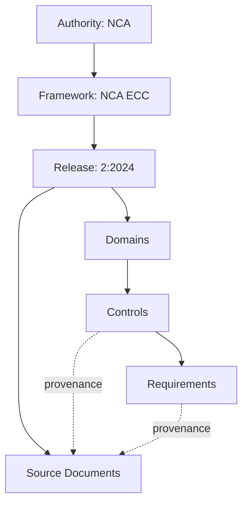
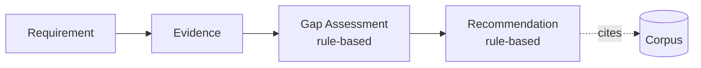

# 06 — QCIF Architecture Bible

> **Quenyx vOPS HUB — Document Metadata**
>
> | Field | Value |
> |---|---|
> | Document Version | 2.0 |
> | Software Version | v1.0.0 RC1 |
> | Applies To | Quenyx vOPS HUB v1.0.0 RC1 |
> | Classification | Confidential — Architecture |
> | Owner | Compliance Engineering |
> | Status | Released |
> | Last Updated | 2026-06-29 |
> | Document Type | Architecture reference |
>
> **Revision History**
>
> | Version | Date | Notes |
> |---|---|---|
> | 1.0 | 2026 | Initial v1 pack (through Sprint 19). |
> | 2.0 | 2026-06-29 | Aligned to v1.0.0 RC1 (Documentation Pack v2.0). |

**Audience:** Architects, auditors.
**Scope:** Consolidates the QCIF sprint docs (`docs/QCIF_*.md`) into one reference for the
**Quenyx Compliance Intelligence Foundation** that powers QynShield.

---

## 1. Corpus philosophy

QCIF is built on one rule: **compliance content comes only from official sources.** The corpus is
not authored by Quenyx or generated by AI — it is **imported from official source documents** and
tracked with full provenance. Every control, requirement, and mapping can be traced back to the
document and authority that produced it.

## 2. Official‑source‑only model

- No hand‑written "sample" controls. The `ComplianceCorpusValidator` actively **rejects** content
  containing markers like `EXAMPLE`, `SAMPLE`, `TEST-`, `FAKE`, `LOREM`, `DEMO`, and lorem‑ipsum
  text.
- Imports are validated, batched, and linked to a **source document** and an **import run**.

## 3. Authorities

The top of the hierarchy is the **authority** (e.g., the National Cybersecurity Authority, **NCA**).
Authorities own frameworks.

## 4. Frameworks

A **framework** (e.g., **NCA ECC**) belongs to an authority and has a stable `framework_key`
(`nca-ecc`). Frameworks own releases.

## 5. Releases

A **release** is a versioned edition of a framework (e.g., **`2:2024`** for ECC‑2:2024). Releases
own the domain/control/requirement hierarchy and are the unit that the API scopes to
(`frameworks/{frameworkKey}/releases/{releaseCode}`).

## 6. Source documents

Each release is backed by **source documents** — the official PDFs/specifications. Imported entities
carry a `source_document_id` so their provenance is explicit. Source documents are loaded via
`compliance:seed-source-documents`.

## 7. Domains / controls / requirements

The release hierarchy:

**NCA ECC‑2:2024 Revision v1 expected counts:** **5 domains, 108 controls, 108 requirements.**

## 8. Revisions

A **Corpus Revision** is an immutable, approved snapshot of a release's content. Exactly one
revision is **active** per release at a time. Revisions enable reproducibility: the same revision
always yields the same corpus.

## 9. Import runs

Every import is recorded as an **import run** linked to the source document and the resulting
entities — providing an audit trail of what was loaded, when, and from where.

## 10. Manifest / batch workflow

Imports follow a **manifest → batch** workflow: a manifest declares what will be imported; batches
apply it transactionally; validators run before commit. This keeps imports idempotent and auditable.

## 11. Validators

`ComplianceCorpusValidator` enforces structural and content rules: forbidden fake‑data markers,
required codes, normalized code uniqueness, and provenance presence. Validation **fails closed** —
invalid content is rejected, not silently accepted.

## 12. Rollback

Because revisions are immutable snapshots and imports are recorded as runs, a release can be **rolled
back** to a prior active revision. *(Operational rollback command — run on server; see Doc 18.)*

## 13. NCA ECC‑2:2024 Revision v1

The shipped framework: authority **NCA**, framework **`nca-ecc`**, release **`2:2024`**, **Revision
v1** active, modelled from official source documents, with **5 domains / 108 controls / 108
requirements**, plus evidence types. Verification commands are in the QA report.

## 14. Evidence / gap / recommendation layers

Built on the corpus, all **deterministic** and **read‑only**:

- **Evidence Intelligence** — evidence types, statuses, and context per requirement/control.
- **Gap Assessment** — correlates evidence to requirements and derives gap status by **rule**
  (e.g., missing evidence ⇒ gap), never by guesswork.
- **Recommendation Engine** — rule‑based recommendations (e.g., collect‑evidence) with explicit
  source rules (`ComplianceReasoningRuleSet::catalog()`).

## 15. No‑fake‑data principles

- Official source only; validator‑enforced.
- Executive metrics derive from **real engine counts**, never fabricated percentages.
- The Copilot is **citation‑enforced**: no corpus citation ⇒ no answer.
- UUID‑only identifiers for all corpus entities.

## 16. Future frameworks

The model is framework‑agnostic: additional authorities/frameworks/releases can be imported using
the same manifest/validator/revision machinery. Today **only NCA ECC‑2:2024** is loaded; more
frameworks are roadmap.
