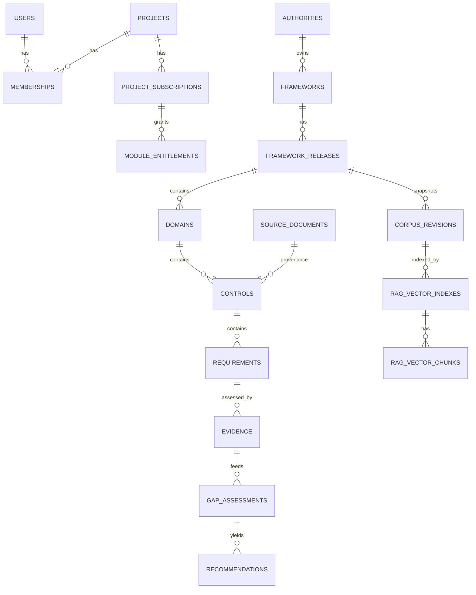

# 09 — Database Reference

**Audience:** Engineers, DBAs, auditors.
**Source:** Derived from `backend/database/migrations` (**65 migrations**) and models at Sprint 19.
Engine: **MySQL** via Eloquent. Regenerate this doc when migrations change.

> **Conventions.** Domain entities (corpus, AI, RAG) use **UUID** identifiers. Corpus content is
> **immutable + provenance‑tracked**. Timestamps are standard Laravel `created_at/updated_at`.

---

## 1. Major table groups

| Group | Purpose | Representative migrations |
|---|---|---|
| Identity & tenancy | Users, projects/workspaces, memberships, invites | `create_users_table`, `create_projects_table`, `create_project_members_table` → `rename_project_members_to_memberships`, `create_project_invites_table` |
| Plans & subscriptions | Plans, module subscriptions, project subscriptions | `create_plans_table`, `create_module_subscriptions_table`, `create_project_subscriptions_table` |
| Modules & overrides | Module catalog, per‑project overrides | `create_modules_table`, `create_project_module_overrides_table`, `cleanup_non_shield_modules` |
| Integrations | Integration defs + configurations | `create_integrations_table`, `create_integration_configurations_table`, `create_billing_integrations_table` |
| Audit | Audit log | `create_audit_logs_table`, `qcif_sprint_1_1_audit_hardening` |
| QynSight (observe) | Services, targets, hosts, alerts, metrics, port scans | `create_observe_services_table`, `create_observe_targets_*`, `create_observe_alert_tables`, `create_observe_metrics_history_table`, `create_host_port_scans_tables` |
| Agents | Agents + enrollment tokens | `create_agents_tables`, `enhance_agent_enrollment_tokens` |
| Queue | Jobs | `create_jobs_table`, `create_failed_jobs_table` |
| QCIF corpus | Authorities → frameworks → releases → domains/controls/requirements, revisions, source docs, import runs | `create_compliance_corpus_tables`, `harden_compliance_corpus_schema`, `qcif_sprint_2_corpus_provenance_preparation`, `qcif_sprint_2a_versioning_hierarchy` |
| QCIF mapping | Cross‑framework mapping | `qcif_sprint_8_mapping_foundation` |
| QCIF evidence/gap/rec | Evidence, gap assessment, recommendations | `create_compliance_evidence_tables`, `create_compliance_gap_tables`, `create_compliance_recommendation_tables` |
| AI orchestration | Conversations/messages metadata | `create_ai_orchestration_tables` |
| RAG vectors | Vector index metadata | `create_rag_vector_tables` |

## 2. Workspace / user / project tables

- **users** — accounts (auth via Sanctum). Profile stats added later; role/preferences columns were
  added then removed (see `add_role_and_preferences…` + `remove_role_and_preferences…`).
- **projects** — the tenant/workspace entity.
- **project memberships** (renamed from `project_members`) — user↔project with role.
- **project_invites** — pending invitations (token‑based accept).

## 3. Module / subscription tables

- **modules** — module catalog (keys like `qynsight`, `qynshield`, …).
- **module_subscriptions / project_subscriptions** — entitlement of modules to a project/plan.
- **project_module_overrides** — explicit per‑project access overrides (audited).
- **plans** — subscription plans.

## 4. QynSight tables (`observe_*`, agents)

- **observe_services / observe_service_definitions** — service‑check definitions and instances
  (Nagios‑style fields, check/retry intervals).
- **observe_targets / observe_targets_services / observe_targets_hosts** — monitored targets, their
  services, and hosts (with public IP).
- **observe_alert tables** — alert rules, events, channels, monitoring profiles, evaluation.
- **observe_metrics_history** — historical metrics.
- **host_port_scans** — port‑scan results.
- **agents / agent enrollment tokens** — host agents and their enrollment credentials.

## 5. QCIF tables

Hierarchy (UUID, immutable, provenance‑linked):

- **authorities** → **frameworks** → **framework_releases** → **domains** → **controls** →
  **requirements**.
- **source_documents** — official documents; imported entities carry `source_document_id`.
- **corpus_revisions** — immutable approved snapshots; one **active** per release.
- **import_runs** — record of each import (linked to source doc + entities).

## 6. AI orchestration tables

- Conversation/message **metadata** tables (`create_ai_orchestration_tables`). **Prompt content is
  not stored** unless prompt logging is explicitly enabled (default off), and conversations are not
  persisted unless persistence is enabled (default off).

## 7. Evidence / gap / recommendation tables

- **Evidence** — evidence records, types, statuses tied to requirements/controls.
- **Gap** — gap assessments correlating evidence to requirements (rule‑derived status).
- **Recommendation** — rule‑based recommendations with source rule IDs.

## 8. RAG vector metadata tables

From `create_rag_vector_tables`:

- **rag_vector_indexes** — one row per indexed corpus revision (provider, model, status, provenance;
  UUID). **No tenant evidence by default.**
- **rag_vector_chunks** — chunk metadata (UUID, content hash, citation linkage). **Metadata only** —
  no fabricated vectors; real similarity requires a real vector backend.

## 9. Important enums

- **Alert event status** (observe) — normalized via `fix_observe_alert_events_status_enum`.
- **Evidence status** — e.g., compliant / partially‑compliant / no‑evidence / expired / rejected /
  pending (surfaced by the executive scorecard).
- **Corpus revision status** — draft/active (immutability of active revisions).
- **Agent protocol** — migrated `nrpe` → `psap` (`migrate_agent_protocol_nrpe_to_psap`).

## 10. Key relationships

## 11. Immutability rules

- Active **corpus revisions** are immutable snapshots; changes create new revisions, never in‑place
  edits.
- Imported corpus entities are validated against fake‑data markers before commit.

## 12. UUID rules

- All QCIF corpus entities, AI orchestration metadata, and RAG vector metadata are **UUID‑keyed**.
- API resources expose **UUIDs / codes**, not raw auto‑increment IDs, for domain entities.

## 13. Migration notes

- **Never edit an already‑run migration**; fix forward with a new migration (Track‑B rule).
- Several observe migrations are **refactors** (rename engine → native, fix interval units, refresh
  schemas) — apply in order.
- Run `php artisan migrate --force` and `migrate:status` on the server (see QA report). The audit
  sandbox could not run these (no `pdo_mysql`).
